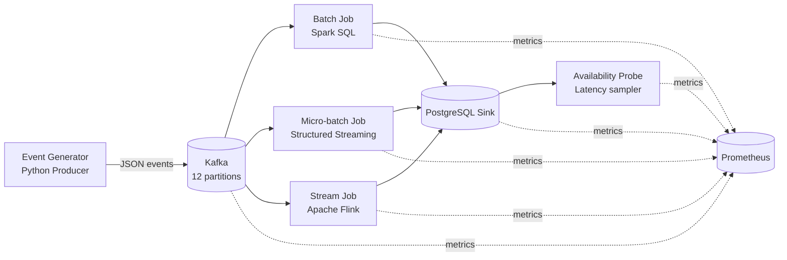
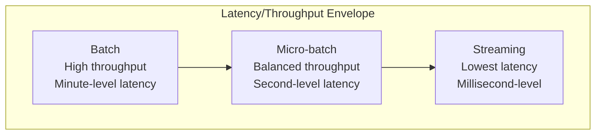

# Data Ingestion Strategies: A Comparative Benchmark

[](https://opensource.org/licenses/MIT)
[](https://www.python.org/downloads/)
[](https://openjdk.org/)

A comprehensive benchmark comparing three data ingestion architectures: **Batch Processing** (Apache Spark), **Micro-batch Processing** (Spark Structured Streaming), and **Stream Processing** (Apache Flink). The official thesis scope is limited to the three official scenarios `low-load`, `medium-load`, and `high-load`.

## Research Questions

1. **RQ1**: How does ingestion strategy affect end-to-end latency under varying workloads?
2. **RQ2**: What is the throughput-latency trade-off for each strategy?
3. **RQ3**: How resource-efficient is each strategy in terms of CPU, memory, and cost?
4. **RQ4**: How do strategies handle failures and recovery?

## Key Findings

| Strategy | Latency (p50) | Throughput | Recovery Time | Best Use Case |
|----------|---------------|------------|---------------|---------------|
| **Batch** | ~2 minutes | Very High | N/A (scheduled) | Historical analytics, ETL |
| **Micro-batch** | ~5 seconds | High | < 30s | Near real-time dashboards |
| **Stream** | ~200ms | Medium-High | < 10s | Real-time monitoring, IoT |

*Results from distributed deployment (4-VM AWS topology, medium load)*

## Official Workflow

### Prerequisites
- **Docker** 20.10+ and **Docker Compose** 2.x
- **Python** 3.11+ with the project package installed in `.venv`
- **Java** 17 for Spark/Flink job builds
- 16GB RAM, 4 CPU cores for local debugging
- AWS credentials and Terraform/Ansible for distributed execution

The public entrypoint is:

```bash
bash scripts/thesis.sh <subcommand> [options]
```

The lower-level scripts in `scripts/run.sh`, `scripts/experiment.sh`, `scripts/collect-results.sh`, and `scripts/check-clock-sync.sh` are internal helpers used by `thesis.sh`. Use them directly only for manual recovery/resume workflows.

### Scopes and result roots

| Scope | Purpose | Load profile | Compute region | Result root |
|------|---------|--------------|----------------|-------------|
| `official` | Thesis baseline comparison across the three official scenarios | `constant` | `primary` | `results-distributed/` |
| `advanced` | Appendix/stress experiments such as cyclic or bursty workloads | `cyclic` or `bursty` | `primary` or `brazil` | `results-advanced/` |

The workflow is intentionally split into three phases:

1. Infrastructure provisioning/deployment
2. Experiment execution
3. Collection, analysis, and validation

## Local Workflow

Use local mode only for debugging and quick verification.

### Local Setup

```bash
git clone <repository-url>
cd data-ingestion-strategies
cp .env.example .env
```

The first local run will automatically execute local setup, image build, and container startup unless you pass `--skip-setup`.

### Local Execution

Quick local debug run:

```bash
bash scripts/thesis.sh run --mode local --reps 1 --duration 60 --warmup 5 --cooldown 5
```

Longer local debug run:

```bash
bash scripts/thesis.sh run --mode local --reps 1 --duration 120 --warmup 10 --cooldown 10
```

### Local Results and Analysis

```bash
bash scripts/thesis.sh analyze --mode local
bash scripts/thesis.sh validate --mode local
```

### Local Teardown

```bash
bash scripts/thesis.sh destroy --mode local
```

Local outputs are written to `results/`.

## Distributed Workflow

Use distributed mode for the official thesis execution.

### 1. Infrastructure

Provision and deploy:

```bash
bash scripts/thesis.sh provision --mode distributed
bash scripts/thesis.sh deploy --mode distributed
```

### 2. Execution

Official full run (45 runs: 3 strategies × 3 scenarios × 5 reps):

```bash
bash scripts/thesis.sh run \
  --mode distributed \
  --scope official \
  --compute-region primary \
  --load-profile constant \
  --results-dir results-distributed
```

Reduced official run for long but manageable sessions:

```bash
bash scripts/thesis.sh run \
  --mode distributed \
  --scope official \
  --compute-region primary \
  --load-profile constant \
  --results-dir results-distributed \
  --strategies "batch microbatch streaming" \
  --scenarios "low-load medium-load high-load" \
  --reps 3 \
  --duration 180 \
  --warmup 30 \
  --cooldown 30
```

Resume-style runs can limit the strategy list, for example continuing from micro-batch onward without deleting existing Batch results:

```bash
bash scripts/thesis.sh run \
  --mode distributed \
  --scope official \
  --compute-region primary \
  --load-profile constant \
  --results-dir results-distributed \
  --strategies "microbatch streaming" \
  --scenarios "low-load medium-load high-load" \
  --reps 4 \
  --duration 200 \
  --warmup 30 \
  --cooldown 30
```

Short distributed verification run:

```bash
bash scripts/thesis.sh run --mode distributed --scope official --reps 1 --duration 60 --warmup 5 --cooldown 5
```

### 3. Results and Analysis

Distributed results pipeline:

```bash
bash scripts/thesis.sh collect --mode distributed
bash scripts/thesis.sh analyze --mode distributed
bash scripts/thesis.sh validate --mode distributed
```

### 4. Distributed Teardown

```bash
bash scripts/thesis.sh destroy --mode distributed
```

Distributed official outputs are written to `results-distributed/`.

### Advanced cyclic workflow

Advanced runs are separated from the thesis baseline and should use `results-advanced/`:

```bash
bash scripts/thesis.sh deploy --mode distributed --compute-region brazil

bash scripts/thesis.sh run \
  --mode distributed \
  --scope advanced \
  --compute-region brazil \
  --load-profile cyclic \
  --results-dir results-advanced \
  --strategies "batch microbatch streaming" \
  --scenarios "cyclic-load-br-compute" \
  --reps 1 \
  --duration 300 \
  --warmup 30 \
  --cooldown 30

bash scripts/thesis.sh collect --mode distributed --results-dir results-advanced
bash scripts/thesis.sh analyze --mode distributed --scope advanced --results-dir results-advanced
bash scripts/thesis.sh validate --mode distributed --results-dir results-advanced
```

## Convenience Mode

If you already understand the three-phase workflow, you can still use:

```bash
bash scripts/thesis.sh full --mode distributed --deploy
```

## Project Structure

```
data-ingestion-strategies/
├── src/
│   ├── jobs/                      # Processing implementations (Java)
│   │   ├── batch/                 # Spark Batch Job
│   │   ├── microbatch/            # Spark Structured Streaming Job
│   │   ├── streaming/             # Flink Streaming Job
│   │   └── common/                # Shared utilities
│   └── python/                    # Benchmark tools
│       └── benchmark/
│           ├── probe/             # Latency measurement
│           ├── analysis/          # Statistical analysis & visualization
│           ├── validation/        # Result validation
│           └── generator/         # Event generator
├── infra/                         # Infrastructure as Code
│   ├── docker/
│   │   ├── compose/               # Docker Compose configurations
│   │   └── images/                # Multi-stage Dockerfiles
│   ├── terraform/                 # AWS provisioning
│   ├── ansible/                   # Configuration management
│   └── config/                    # Service configurations
├── scripts/                       # Official workflow + execution scripts
├── docs/                          # Technical architecture documentation
├── results/                       # Local debug outputs
├── results-distributed/           # Official distributed outputs (ignored by git)
├── results-advanced/              # Advanced appendix/stress outputs (ignored by git)
```

## Architecture Overview

### Data Flow



### Components at a glance

- **Producer (`benchmark.generator`)**: generates synthetic events with `event_id`, `produced_at`, payload size, and scenario-specific rate; writes to Kafka topic `events`.
- **Kafka (broker + topic partitions)**: decouples producers from consumers, buffers bursts, and enables parallel consumption (12 partitions by default).
- **Processing strategies**:
  - **Batch (Spark Batch)**: reads accumulated offsets and writes in larger JDBC batches.
  - **Micro-batch (Spark Structured Streaming)**: processes periodic mini-batches with trigger/checkpoint semantics.
  - **Streaming (Flink)**: continuous event-at-a-time pipeline with low-latency sink writes.
- **Sink (PostgreSQL)**: persistence layer where each row gets `visible_at` (insert visibility timestamp), enabling a common latency reference.
- **Observability (Prometheus + exporters + cAdvisor)**: scrapes throughput, lag, and resource metrics across all services.
- **Probe (`benchmark.probe.availability_probe`)**: continuously polls sink for newly visible rows and computes end-to-end latency as:

```text
latency_ms = visible_at - produced_at
```

Probe outputs are written to `latency_samples.csv` and are the primary source for statistical analysis and validation.

### Topology & Data Budget (Thesis Defense)

- **Distributed network topology (4 VMs)**:
  - `node-producers (10.0.1.10)`: Generator + Probe
  - `node-broker (10.0.1.20)`: Kafka + ZooKeeper + kafka-exporter
  - `node-compute (10.0.1.30)`: Spark + Flink
  - `node-sink (10.0.1.40)`: PostgreSQL + Prometheus
- **Main data-plane flow**: `Generator -> Kafka:9092 -> Spark/Flink -> PostgreSQL:5432 -> Probe(read-only)`
- **Observability flow**: `Prometheus(node-sink) -> scrape targets (probe, exporter, cadvisor, engines)`
- **Event payload model**: JSON UTF-8 with `event_id`, `produced_at`, `schema`, domain fields, and `payload`.

Official thesis scenario profile used by this repository (`high-load = 30,000 ev/s`):

| Escenario | Tasa objetivo | Payload base | Schema | Eventos estimados por run (300s) |
|----------|---------------:|-------------:|--------|----------------------------------:|
| low-load | 2,000 ev/s | 1,500 B | `iot_sensor` | 600,000 |
| medium-load | 10,000 ev/s | 1,500 B | `financial_tick` | 3,000,000 |
| high-load | 30,000 ev/s | 1,500 B | `health_monitor` | 9,000,000 |

Approximate generated volume (JSON over Kafka) for a 300s run:

- **low-load**: ~0.95-1.1 GB
- **medium-load**: ~4.8-5.6 GB
- **high-load**: ~14.4-16.8 GB

For full defense-oriented details (protocols, ports, data types, formulas, and per-experiment totals), see:
- `docs/architecture.md`



### Processing Strategies

#### 1. Batch Processing (Apache Spark)
- **Model**: MapReduce paradigm
- **Latency**: Minutes to hours (depends on schedule)
- **Throughput**: Very high (optimized for large batches)
- **Use Case**: Historical analysis, overnight ETL

**Implementation**: `src/jobs/batch/SparkBatchJob.java`

#### 2. Micro-batch Processing (Spark Structured Streaming)
- **Model**: Mini-batch streaming with configurable triggers
- **Latency**: Seconds (configurable trigger interval)
- **Throughput**: High
- **Use Case**: Near real-time dashboards, windowed aggregations

**Implementation**: `src/jobs/microbatch/SparkStructuredJob.java`

#### 3. Stream Processing (Apache Flink)
- **Model**: True event-at-a-time processing with event-time semantics
- **Latency**: Milliseconds
- **Throughput**: Medium to high
- **Use Case**: Real-time alerting, fraud detection, IoT

**Implementation**: `src/jobs/streaming/FlinkStreamingJob.java`

## Documentation

- **[Architecture](docs/architecture.md)**: system design, deployment topology, data model, network flows, and official benchmark baseline

## Reproducibility

This benchmark follows a simple reproducibility model:

- **Containerized**: Docker-based local and distributed runtime
- **Declarative**: Terraform + Ansible for distributed provisioning
- **Versioned**: code, configs, and analysis tracked in git
- **Validated**: result validation via `benchmark.validation.validator`

## Official Commands

```bash
# Local debug flow
bash scripts/thesis.sh run --mode local --reps 1 --duration 60 --warmup 5 --cooldown 5
bash scripts/thesis.sh analyze --mode local
bash scripts/thesis.sh validate --mode local
bash scripts/thesis.sh destroy --mode local

# Distributed official flow
bash scripts/thesis.sh provision --mode distributed
bash scripts/thesis.sh deploy --mode distributed
bash scripts/thesis.sh run --mode distributed
bash scripts/thesis.sh collect --mode distributed
bash scripts/thesis.sh analyze --mode distributed
bash scripts/thesis.sh validate --mode distributed
bash scripts/thesis.sh destroy --mode distributed
```

## Results & Metrics

### Primary Metrics
- **End-to-end Latency**: Time from event production to visibility in sink (p50, p95, p99)
- **Throughput**:
  - generated real (`generated_events / generation_duration_seconds`)
  - visible equivalente normalizado a ventana oficial (`visible_events / official_duration_seconds`)
- **Resource Usage**: average CPU cores and memory RSS by strategy/scenario

### Secondary Metrics
- **Consumer Lag**: diagnostic-only, only when real exporter coverage exists

Figures are exported in publication-ready formats:
- **PNG**: Quick preview for notebooks/slides
- **PDF**: Thesis and paper inclusion (vector quality)

Current official figure set (thesis-focused):
- `fig_11_1_latency_distribution.*`: latency distribution by strategy/scenario.
- `fig_11_2_official_window_throughput.*`: generated-real throughput vs sink-visible throughput in the official window.
- `fig_11_3_delivery_ratio_cutoff_vs_drain.*`: delivery ratio at cutoff vs after drain.
- `fig_11_4_pending_visibility_backlog.*`: pending visibility backlog estimate.
- `fig_11_4b_kafka_consumer_lag_real.*`: diagnostic lag figure only when real lag coverage exists.
- `fig_11_5_drain_time.*`: time from generation end to processing drain completion.
- `fig_11_6_compute_resource_usage.*`: average CPU and memory usage by strategy/scenario.

Current CSV outputs:
- `official_metrics_summary.csv`: main official metrics table.
- `latency_summary_table.csv`: latency summary by strategy/scenario/run.
- `statistical_tests.csv`: generated when enough comparable latency samples exist.

Advanced cyclic outputs:
- `fig_a1_cyclic_response_timeseries.*`
- `fig_a2_observable_backlog_timeseries.*`
- `fig_a4_latency_distribution_cyclic.*`
- `generator_rate_timeline.csv`, `sink_visibility_timeline.csv`, `latency_timeseries.csv`, `backlog_timeseries.csv`

## Operational Safety and Troubleshooting

- Do not delete `results-distributed/` or `results-advanced/` while an experiment is running or when resuming partial results.
- `scripts/run.sh` truncates the PostgreSQL `events` table before each run; this is expected for isolated runs but means it should not be used casually during active experiments.
- `scripts/collect-results.sh` replaces the local destination directory before copying from the sink node. Run it only when you are ready to sync remote results locally.
- If PostgreSQL reports `database system is in recovery mode`, check disk space on the sink VM and redeploy after freeing space.
- Distributed runs enforce NTP checks through `scripts/check-clock-sync.sh`; clock skew above the threshold invalidates latency measurements.
- `destroy` tears down local or distributed infrastructure. Do not run it while preserving active experiments.

## Notes

1. **Local Mode**: Requires 16GB+ RAM for concurrent strategies
2. **Distributed Mode**: A full 45-run distributed experiment can take around 5 hours and should be executed in sessions
3. **Official Scope**: the official thesis benchmark uses only `low-load`, `medium-load`, and `high-load`
4. **Cost**: AWS distributed tests cost roughly a few USD per full benchmark session, depending on instance uptime

## License

MIT License - see [LICENSE](LICENSE) for details.

## Support

- **Issues**: [GitHub Issues](https://github.com/username/data-ingestion-strategies/issues)
- **Documentation**: [docs/](docs/)
- **Thesis**: [Link to published thesis]

---

**Status**: Production-ready for thesis defense  
**Last Updated**: 2026-04-06
