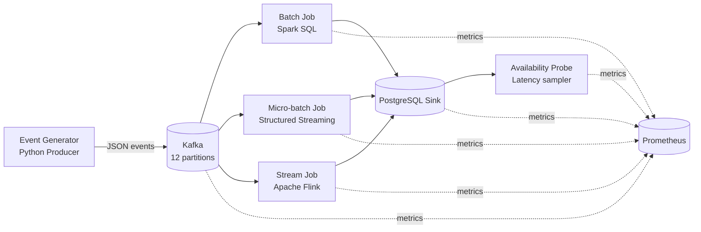
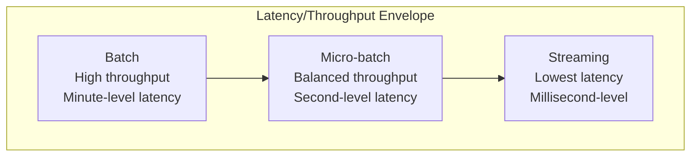

# Data Ingestion Strategies: A Comparative Benchmark

[](https://opensource.org/licenses/MIT)
[](https://www.python.org/downloads/)
[](https://openjdk.org/)

A comprehensive benchmark comparing three data ingestion architectures: **Batch Processing** (Apache Spark), **Micro-batch Processing** (Spark Structured Streaming), and **Stream Processing** (Apache Flink). This research quantifies trade-offs between latency, throughput, resource efficiency, and fault tolerance.

## 🎯 Research Questions

1. **RQ1**: How does ingestion strategy affect end-to-end latency under varying workloads?
2. **RQ2**: What is the throughput-latency trade-off for each strategy?
3. **RQ3**: How resource-efficient is each strategy in terms of CPU, memory, and cost?
4. **RQ4**: How do strategies handle failures and recovery?

## 🏆 Key Findings

| Strategy | Latency (p50) | Throughput | Recovery Time | Best Use Case |
|----------|---------------|------------|---------------|---------------|
| **Batch** | ~2 minutes | Very High | N/A (scheduled) | Historical analytics, ETL |
| **Micro-batch** | ~5 seconds | High | < 30s | Near real-time dashboards |
| **Stream** | ~200ms | Medium-High | < 10s | Real-time monitoring, IoT |

*Results from distributed deployment (3-node AWS cluster, medium load)*

## 🚀 Quick Start

### Prerequisites
- **Docker** 20.10+ and **Docker Compose** 2.x
- 16GB RAM, 4 CPU cores (for local mode)
- *(Optional)* AWS account for distributed deployment

### Run Complete Benchmark (Local)

```bash
# 1. Clone and setup
git clone <repository-url>
cd data-ingestion-strategies
cp .env.example .env

# 2. Run full benchmark (all strategies, all load profiles)
make local-experiment

# 3. Generate analysis charts
make analyze

# 4. View results
ls results/figures/  # PNG/PDF charts
cat results/summary.csv  # Metrics summary
```

**That's it!** Results will be in `results/` directory with publication-ready charts.

### Run Quick Smoke Test (5 minutes)

```bash
make local-smoke
```

## 📊 Project Structure

```
data-ingestion-strategies/
├── src/
│   ├── jobs/                      # Processing implementations (Java)
│   │   ├── batch/                 # Spark Batch Job
│   │   ├── microbatch/            # Spark Structured Streaming Job
│   │   ├── streaming/             # Flink Streaming Job
│   │   └── common/                # Shared utilities
│   └── python/                    # Benchmark tools
│       └── benchmark/
│           ├── probe/             # Latency measurement
│           ├── analysis/          # Statistical analysis & visualization
│           ├── validation/        # Result validation
│           └── generator/         # Event generator
├── infra/                         # Infrastructure as Code
│   ├── docker/
│   │   ├── compose/               # Docker Compose configurations
│   │   └── images/                # Multi-stage Dockerfiles
│   ├── terraform/                 # AWS provisioning
│   ├── ansible/                   # Configuration management
│   └── config/                    # Service configurations
├── scripts/                       # Orchestration scripts
├── docs/                          # Detailed documentation
├── results/                       # Experiment outputs
└── Makefile                       # One-command operations
```

## 🏗️ Architecture Overview

### Data Flow



### Components at a glance

- **Producer (`benchmark.generator`)**: generates synthetic events with `event_id`, `produced_at`, payload size, and scenario-specific rate; writes to Kafka topic `events`.
- **Kafka (broker + topic partitions)**: decouples producers from consumers, buffers bursts, and enables parallel consumption (12 partitions by default).
- **Processing strategies**:
  - **Batch (Spark Batch)**: reads accumulated offsets and writes in larger JDBC batches.
  - **Micro-batch (Spark Structured Streaming)**: processes periodic mini-batches with trigger/checkpoint semantics.
  - **Streaming (Flink)**: continuous event-at-a-time pipeline with low-latency sink writes.
- **Sink (PostgreSQL)**: persistence layer where each row gets `visible_at` (insert visibility timestamp), enabling a common latency reference.
- **Observability (Prometheus + exporters + cAdvisor)**: scrapes throughput, lag, and resource metrics across all services.
- **Probe (`benchmark.probe.availability_probe`)**: continuously polls sink for newly visible rows and computes end-to-end latency as:

```text
latency_ms = visible_at - produced_at
```

Probe outputs are written to `latency_samples.csv` and are the primary source for statistical analysis and validation.



### Processing Strategies

#### 1. Batch Processing (Apache Spark)
- **Model**: MapReduce paradigm
- **Latency**: Minutes to hours (depends on schedule)
- **Throughput**: Very high (optimized for large batches)
- **Use Case**: Historical analysis, overnight ETL

**Implementation**: `src/jobs/batch/SparkBatchJob.java`

#### 2. Micro-batch Processing (Spark Structured Streaming)
- **Model**: Mini-batch streaming with configurable triggers
- **Latency**: Seconds (configurable trigger interval)
- **Throughput**: High
- **Use Case**: Near real-time dashboards, windowed aggregations

**Implementation**: `src/jobs/microbatch/SparkStructuredJob.java`

#### 3. Stream Processing (Apache Flink)
- **Model**: True event-at-a-time processing with event-time semantics
- **Latency**: Milliseconds
- **Throughput**: Medium to high
- **Use Case**: Real-time alerting, fraud detection, IoT

**Implementation**: `src/jobs/streaming/FlinkStreamingJob.java`

## 📖 Detailed Documentation

- **[Architecture](docs/architecture.md)**: System design, components, and implementation details
- **[Architecture: Distributed Topology](docs/architecture.md#23-deployment-topologies-local-and-distributed)**: VM layout, network, protocols, and ports
- **[Experiment Protocol](docs/experiment_protocol.md)**: Methodology, metrics, and statistical analysis
- **[Reproducibility Guide](docs/reproducibility/)**: Environment specs and experiment checklist
- **[Setup Guides](docs/setup/)**:
  - [Local Setup](docs/setup/local.md): Docker Compose walkthrough
  - [Distributed Setup](docs/setup/distributed.md): AWS deployment guide

## 🔬 Reproducibility

This benchmark follows best practices for computational reproducibility:

✅ **Containerized**: All services run in Docker with pinned versions  
✅ **Declarative**: Infrastructure as Code (Terraform + Ansible)  
✅ **Versioned**: Git-tracked configurations and dependencies  
✅ **Documented**: Complete experiment protocol with statistical methods  
✅ **Validated**: Automated result validation scripts

See [Reproducibility Checklist](docs/reproducibility/experiment-checklist.md) for details.

## 🛠️ Development Commands

```bash
# Setup
make setup              # Install dependencies
make build              # Build Docker images

# Local Experiments
make local-experiment   # Full benchmark (all strategies)
make local-smoke        # Quick 5-minute test

# Distributed Deployment (AWS)
make provision          # Provision AWS infrastructure
make distributed-deploy # Deploy services via Ansible
make distributed-experiment  # Run full benchmark on AWS
make distributed-teardown    # Destroy AWS resources

# Thesis one-command pipelines
bash scripts/thesis-run.sh --mode local --profile quick
bash scripts/thesis-run.sh --mode distributed --profile quick

# Analysis
make analyze            # Generate all charts
make validate           # Validate results

# Cleanup
make clean              # Remove build artifacts
make clean-results      # Remove experiment results
```

### Thesis One-Command Runner

Use `scripts/thesis-run.sh` to orchestrate setup, execution, collection, analysis, and validation.

```bash
# Local thesis quick run
bash scripts/thesis-run.sh --mode local --profile quick

# Distributed thesis smoke run
bash scripts/thesis-run.sh --mode distributed --profile smoke

# Distributed stronger run (custom)
bash scripts/thesis-run.sh --mode distributed --strategies "batch microbatch streaming" --scenarios "low-load medium-load high-load" --reps 2 --duration 180

# Optional teardown at end
bash scripts/thesis-run.sh --mode distributed --profile quick --teardown
```

## 📈 Results & Metrics

### Primary Metrics
- **End-to-end Latency**: Time from event production to visibility in sink (p50, p90, p99, p99.9)
- **Throughput**: Events processed per second
- **Resource Usage**: CPU, memory, network I/O per strategy

### Secondary Metrics
- **Consumer Lag**: Kafka offset lag
- **Checkpoint Overhead**: State management cost (Flink)
- **Recovery Time**: Time to restore throughput after failure

### Analysis Tools

```bash
# Generate all charts
python -m benchmark.analysis.analyzer --results-dir results/

# Validate experiment results
python -m benchmark.validation.validator --results-dir results/
```

Charts are exported in multiple formats:
- **PNG**: Quick preview
- **PDF**: LaTeX inclusion (300 DPI, publication-ready)
- **SVG**: Editable vector graphics

## 🐛 Known Limitations

1. **Local Mode**: Requires 16GB+ RAM for concurrent strategies
2. **Distributed Mode**: A full 60-run distributed experiment can take 4-6 hours and should be executed in sessions
3. **Fault Injection**: Manual verification required for complex failure scenarios
4. **Cost**: AWS distributed tests cost ~$5-10 per full benchmark run

## 📚 Citation

If you use this benchmark in your research, please cite:

```bibtex
@software{data_ingestion_benchmark,
  title = {Data Ingestion Strategies: A Comparative Benchmark},
  author = {Your Name},
  year = {2026},
  url = {https://github.com/username/data-ingestion-strategies}
}
```

See [CITATION.cff](CITATION.cff) for complete metadata.

## 📄 License

MIT License - see [LICENSE](LICENSE) for details.

## 🤝 Acknowledgments

- Apache Spark, Apache Flink, Apache Kafka communities
- PostgreSQL, Prometheus, Docker projects
- Research funded by [University/Grant Name]

## 📞 Support

- **Issues**: [GitHub Issues](https://github.com/username/data-ingestion-strategies/issues)
- **Documentation**: [docs/](docs/)
- **Thesis**: [Link to published thesis]

---

**Status**: Production-ready for thesis defense ✅  
**Last Updated**: 2026-04-06
