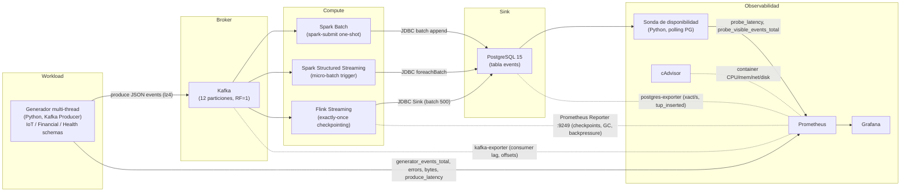
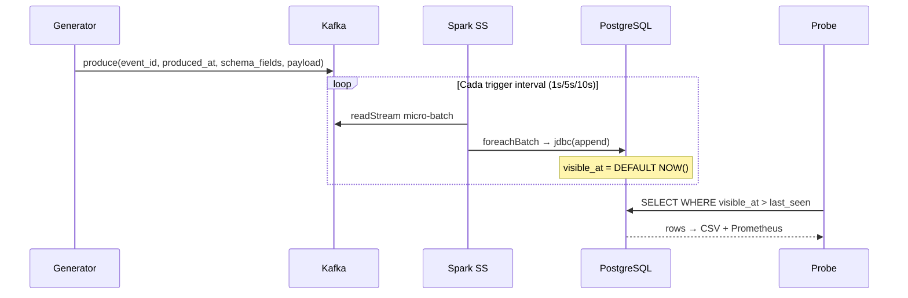

# Arquitectura del Banco de Pruebas

## 1. Objetivo

Medir la **latencia de disponibilidad** y el **throughput de ingesta** de tres estrategias bajo condiciones de alta demanda operativa, comparando estadísticamente sus resultados con tests de significancia.

| # | Estrategia | Motor | Modo de ingesta |
|---|-----------|-------|--------------------|
| 1 | Batch      | Spark 3.5        | Lectura completa de Kafka → escritura Append a PostgreSQL |
| 2 | Micro-batch| Spark Structured Streaming + Kafka | Trigger periódico (1/5/10 s) con `foreachBatch` |
| 3 | Streaming  | Flink 1.18 + Kafka | Flujo continuo exactly-once con JDBC Sink |

**Métrica principal:** `visible_at − produced_at`
- `produced_at` = `System.currentTimeMillis()` en el generador al crear el evento.
- `visible_at` = `DEFAULT (EXTRACT(EPOCH FROM NOW()) * 1000)::BIGINT` en PostgreSQL al hacer INSERT.
- Esta definición garantiza que la medición es **uniforme** para las 3 estrategias.

---

## 2. Diagrama de componentes



---

## 3. Flujo experimental por estrategia

### 3.1 Spark Batch

```mermaid
sequenceDiagram
    participant G as Generator
    participant K as Kafka
    participant SB as Spark Batch
    participant PG as PostgreSQL
    participant P as Probe

    G->>K: produce(event_id, produced_at, schema_fields, payload)
    Note over G,K: Acumula eventos durante ventana
    SB->>K: spark.read().format("kafka").load()
    SB->>PG: writeBatch() via JdbcEventWriter (ON CONFLICT DO NOTHING)
    Note over PG: visible_at = DEFAULT NOW()
    P->>PG: SELECT WHERE visible_at > last_seen LIMIT 1000
    PG-->>P: rows (event_id, produced_at, visible_at, ...)
    Note over P: latency = visible_at − produced_at → CSV + Prometheus

*Nota: Para garantizar una comparación justa, el script `run_batch.sh` incluye una fase de **acumulación** previa de `RUN_DURATION_SECONDS` antes de lanzar el job de Spark, asegurando que el lote procese el mismo volumen de datos que las estrategias de streaming.*
```

### 3.2 Spark Structured Streaming (Micro-batch)



### 3.3 Flink Streaming

```mermaid
sequenceDiagram
    participant G as Generator
    participant K as Kafka
    participant FL as Flink
    participant PG as PostgreSQL
    participant P as Probe

    G->>K: produce(event_id, produced_at, schema_fields, payload)
    FL->>K: KafkaSource (continuous)
    FL->>FL: map(Jackson::parse) → rebalance()
    FL->>PG: JdbcSink (batch=500, interval=50ms) + ON CONFLICT
    Note over PG: visible_at = DEFAULT NOW()
    P->>PG: SELECT WHERE visible_at > last_seen
    PG-->>P: rows → CSV + Prometheus

---

## 4. Robustez y Consistencia

El benchmark implementa varias mejoras críticas para asegurar la validez de los datos:

- **Parseo Robusto (Jackson)**: Se eliminó el parseo basado en expresiones regulares en favor de `Jackson Databind` para manejar correctamente el esquema JSON y evitar corrupciones en payloads complejos.
- **Escritura Idempotente**: Tanto Spark Batch como Flink utilizan estrategias `ON CONFLICT (event_id) DO NOTHING` para permitir re-intentos de jobs sin duplicar datos ni fallar por llaves duplicadas.
- **Cierre Elegante (Graceful Shutdown)**: Flink implementa una terminación controlada a través de `CompletableFuture` que permite hacer un flush final de los buffers JDBC antes de cerrar el proceso, minimizando la pérdida de eventos al final de cada experimento.
```

---

## 4. Modelo de datos

```sql
CREATE TABLE events (
    event_id    UUID        PRIMARY KEY,
    produced_at BIGINT      NOT NULL,               -- ms epoch (generador)
    visible_at  BIGINT      NOT NULL DEFAULT (...)   -- ms epoch (PostgreSQL)
    payload     TEXT        NOT NULL,
    strategy    VARCHAR(32) NOT NULL DEFAULT 'unknown',
    scenario    VARCHAR(32) NOT NULL DEFAULT 'unknown',
    run_id      VARCHAR(64) NOT NULL DEFAULT 'unset'
);

CREATE INDEX idx_events_visible_at ON events (visible_at);
CREATE INDEX idx_events_run        ON events (strategy, scenario, run_id);
```

**Fórmula de latencia:**
```
latencia_disponibilidad (ms) = visible_at − produced_at
```

---

## 5. Escenarios de carga

| Escenario | Tasa base | Payload | Pico | Schema default | Duración |
|-----------|-----------|---------|------|----------------|----------|
| `low-load` | 2.000/s | 512 B | — | iot_sensor | 20 min |
| `medium-load` | 10.000/s | 512 B | — | financial_tick | 20 min |
| `high-load` | 30.000/s | 512 B | — | health_monitor | 20 min |
| `burst` | 10.000/s | 512 B | 50.000/s por 60s cada 5 min | financial_tick | 20 min |
| `extreme-load` | 100.000/s | 512 B | — | iot_sensor | 30 min |
| `mixed-payload` | 10.000/s | 512/4096/65536 B (rotativo) | — | iot_sensor | 20 min |

Cada escenario se repite **5 veces** siguiendo el protocolo:
`clean → warmup (30s) → run (duración) → cooldown (10s) → export`.

---

## 6. Schemas de eventos

### iot_sensor
```json
{
  "event_id": "uuid-v4",
  "produced_at": 1709500000000,
  "schema": "iot_sensor",
  "device_id": "sensor-0042",
  "temperature_c": 22.4,
  "humidity_pct": 58.1,
  "pressure_hpa": 1013.5,
  "battery_v": 3.72,
  "status": "ok",
  "payload": "<random alphanumeric>"
}
```

### financial_tick
```json
{
  "event_id": "uuid-v4",
  "produced_at": 1709500000000,
  "schema": "financial_tick",
  "symbol": "BTC-USD",
  "exchange": "binance",
  "price": 61234.50,
  "bid": 61230.12,
  "ask": 61238.90,
  "volume": 0.42,
  "trade_id": "uuid-v4",
  "payload": "<random alphanumeric>"
}
```

### health_monitor
```json
{
  "event_id": "uuid-v4",
  "produced_at": 1709500000000,
  "schema": "health_monitor",
  "patient_id": "P-8821",
  "device_model": "AppleWatch9",
  "heart_rate_bpm": 78,
  "spo2_pct": 98.2,
  "steps_delta": 5,
  "alert": false,
  "location": "home",
  "payload": "<random alphanumeric>"
}
```

---

## 7. Métricas recolectadas (completo)

| Categoría | Métrica | Fuente |
|-----------|---------|--------|
| **Latencia** | `probe_latency` (hist p50/p75/p95/p99/mean) | Probe → Prometheus |
| **Throughput** | `probe_visible_events_total`, `probe_throughput_events_per_sec` | Probe → Prometheus |
| **Generación** | `generator_events_total`, `generator_errors_total`, `generator_bytes_total` | Generator → Prometheus |
| **Latencia de producción** | `generator_produce_latency_ms` (hist p50/p99) | Generator → Prometheus |
| **CPU** | `container_cpu_usage_seconds_total`, `container_cpu_cfs_throttled_*` | cAdvisor → Prometheus |
| **Memoria** | `container_memory_usage_bytes`, `container_memory_rss` | cAdvisor → Prometheus |
| **Red** | `container_network_receive/transmit_bytes_total` | cAdvisor → Prometheus |
| **Disco** | `container_fs_reads/writes_bytes_total` | cAdvisor → Prometheus |
| **Kafka** | Consumer lag (sum/max), offsets, particiones | kafka-exporter → Prometheus |
| **PostgreSQL** | Conexiones, transacciones/s, tuplas insertadas/s, tamaño DB | postgres-exporter → Prometheus |
| **Flink** | Records in/out, checkpoints (dur/size/count), backpressure, Heap, GC time | Flink Reporter → Prometheus |
| **CSV** | `latency_samples.csv`: event_id, produced_at, visible_at, latency_ms, strategy, scenario, run_id | Probe → disco |
| **Snapshot CSV** | `prometheus_snapshot.csv`: snapshot de ≥36 métricas por corrida | export_metrics.py → disco |

---

## 8. Análisis estadístico

Por cada escenario se ejecutan:
- **Kruskal-Wallis H test** (no paramétrico): ¿son las distribuciones de latencia de las 3 estrategias estadísticamente diferentes?
- **Mann-Whitney U pairwise** con **corrección Bonferroni**: comparaciones por pares con p-valores ajustados.

### Gráficas generadas (12 total)

| # | Archivo | Descripción |
|---|---------|-------------|
| 01 | `01_boxplot_latencia.png` | Distribución de latencia por estrategia y escenario |
| 02 | `02_cdf_latencia.png` | CDF acumulada de latencia |
| 03 | `03_percentiles_barras.png` | Barras p50/p95/p99 por escenario |
| 04 | `04_throughput.png` | Throughput promedio ± SD |
| 05 | `05_estabilidad_runs.png` | Variabilidad entre repeticiones |
| 06 | `06_tabla_resumen.png/.csv` | Tabla completa de métricas por estrategia/escenario |
| 07 | `07_latencia_temporal.png` | Evolución temporal de latencia (p50 + banda p95) |
| 08 | `08_eficiencia_recursos.png` | Scatter: latencia p95 vs. CPU promedio |
| 09 | `09_kafka_lag.png` | Consumer lag máximo por estrategia y escenario |
| 10 | `10_tasa_errores.png` | Tasa de errores de generador y probe |
| 11 | `11_significancia.png/.csv` | Tabla de p-valores Kruskal-Wallis y Bonferroni |
| 12 | `12_radar_multikpi.png` | Radar chart multi-KPI normalizado holístico |

---

## 9. Servicios Docker Compose

| Servicio | Imagen | Puerto | Rol |
|----------|--------|--------|-----|
| `zookeeper` | confluentinc/cp-zookeeper:7.5.3 | 2181 | Coordinación Kafka |
| `kafka` | confluentinc/cp-kafka:7.5.3 | 9092 | Broker de eventos (12 particiones) |
| `kafka-exporter` | danielqsj/kafka-exporter:v1.7.0 | 9308 | Métricas Kafka |
| `spark-master` | apache/spark:3.5.8-java17 | 7077, 8080 | Coordinador Spark |
| `spark-worker` | apache/spark:3.5.8-java17 | — | Ejecutor (4 cores, 2 GB) |
| `flink-jobmanager` | flink:1.18.1-scala_2.12-java17 | 8081, 9249 | Coordinador Flink (2 GB) |
| `flink-taskmanager` | flink:1.18.1-scala_2.12-java17 | 9250 | Ejecutor (4 slots, 2 GB) |
| `postgres` | postgres:15 | 5432 | Sink (tabla events) |
| `postgres-exporter` | postgres-exporter:v0.15.0 | 9187 | Métricas PostgreSQL |
| `cadvisor` | cadvisor:v0.49.1 | 8888 | Métricas de contenedores |
| `prometheus` | prometheus:v2.49.1 | 9090 | Almacén de métricas |
| `grafana` | grafana:10.3.1 | 3000 | Visualización |
| `generator` | python:3.11-slim (custom) | 8000 | Generador multi-thread |
| `probe` | python:3.11-slim (custom) | 8001 | Sonda de disponibilidad |

---

## 10. Estructura de resultados

```
results/
├── latency_samples.csv           # CSV acumulado del probe (todos los runs)
├── figures/                      # 12 gráficas generadas por analyze.py
│   ├── 01_boxplot_latencia.png
│   ├── 02_cdf_latencia.png
│   ├── ...
│   └── 12_radar_multikpi.png
├── batch/
│   ├── low-load/
│   │   ├── run_1/
│   │   │   ├── latency_samples.csv
│   │   │   └── prometheus_snapshot.csv
│   │   └── run_2/ ... run_5/
│   ├── medium-load/ ...
│   ├── high-load/ ...
│   ├── burst/ ...
│   ├── extreme-load/ ...
│   └── mixed-payload/ ...
├── microbatch/ ...
└── streaming/ ...
```
