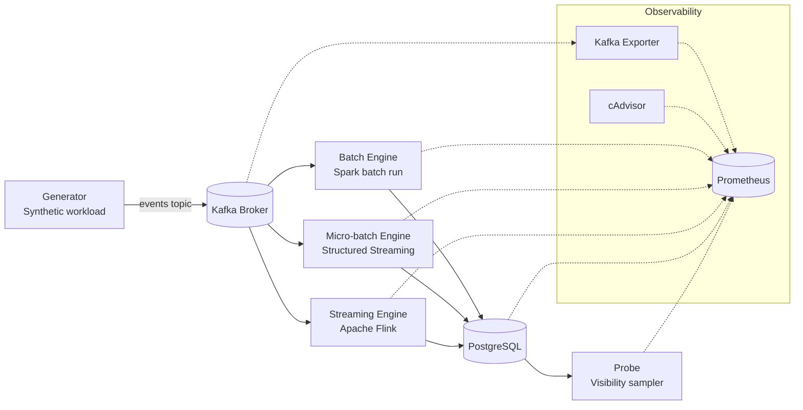
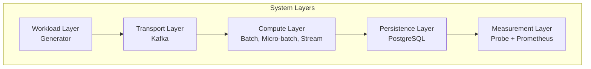
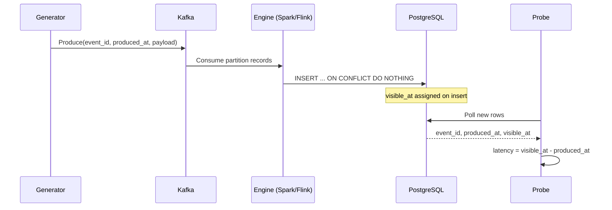
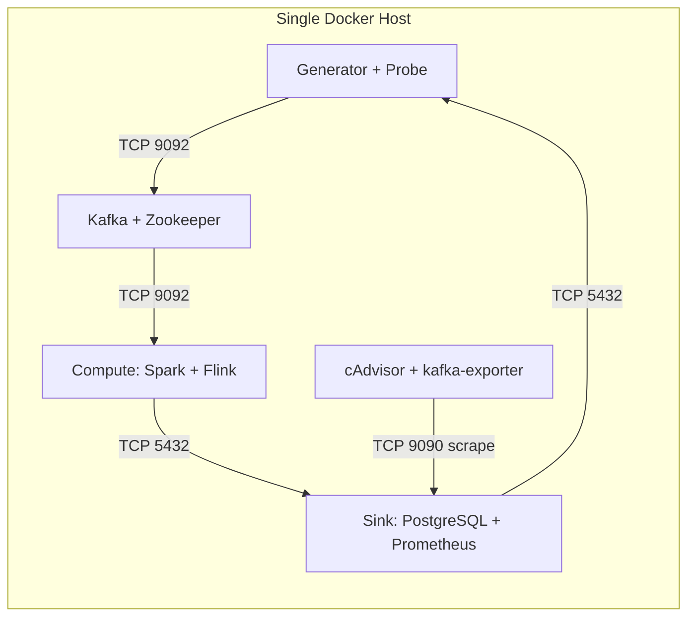
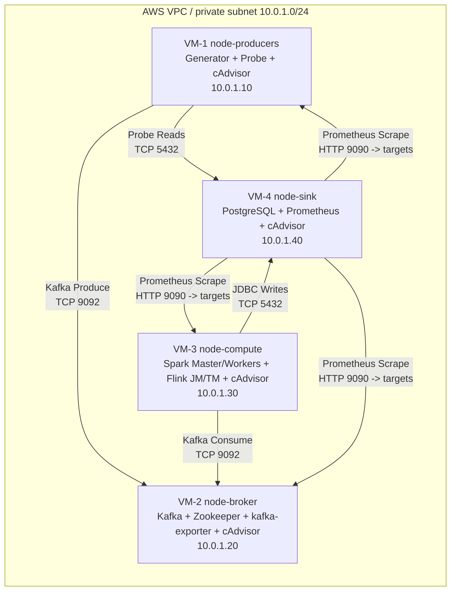

# System Architecture

## 1. Introduction

This document provides a comprehensive architectural overview of the data ingestion benchmark system, including design decisions, implementation details, and theoretical foundations.

### 1.1 Motivation

Modern data systems must process events at scale with varying latency requirements. Three dominant paradigms exist:

1. **Batch Processing**: High-throughput historical analysis (MapReduce, Apache Spark)
2. **Micro-batch Streaming**: Balance between latency and throughput (Spark Structured Streaming)
3. **True Streaming**: Low-latency event-at-a-time processing (Apache Flink, Apache Storm)

This benchmark quantifies the trade-offs between these approaches using a controlled experimental setup.

### 1.2 Scope

**In Scope**:
- End-to-end latency measurement (producer → sink)
- Throughput analysis under varying load
- Resource efficiency (CPU, memory, network)
- Fault recovery behavior

**Out of Scope**:
- Complex stateful operations (joins, sessionization)
- Multi-datacenter deployments
- Security and authentication mechanisms
- Cost optimization strategies

## 2. Reference Architecture

### 2.1 High-Level Overview





### 2.2 Data Flow



1. **Event Generation**: Producer generates events with UUID, timestamp, and payload
2. **Message Brokering**: Kafka buffers events across 12 partitions
3. **Processing**: Strategy-specific engine consumes, processes, and writes to PostgreSQL
4. **Sink Persistence**: PostgreSQL records `visible_at` timestamp on INSERT
5. **Latency Measurement**: Probe continuously queries PostgreSQL for new events
6. **Metrics Collection**: Prometheus scrapes metrics from all components

### 2.3 Deployment Topologies (Local and Distributed)

The benchmark supports two operational topologies:

- **Local topology**: all services run on one workstation via `infra/docker/compose/docker-compose.yml`
- **Distributed topology**: services are split across 4 VMs in a private cloud network and orchestrated with Terraform + Ansible

#### 2.3.1 Local Topology (Single Host)



#### 2.3.2 Distributed Topology (4 VMs)



#### 2.3.3 Communication Protocols and Ports

| Source | Destination | Protocol | Port(s) | Purpose |
|--------|-------------|----------|---------|---------|
| Generator | Kafka broker | Kafka/TCP | `9092` | Publish `events` topic |
| Spark/Flink jobs | Kafka broker | Kafka/TCP | `9092` | Consume events |
| Spark/Flink jobs | PostgreSQL sink | PostgreSQL/TCP | `5432` | Persist processed events |
| Probe | PostgreSQL sink | PostgreSQL/TCP | `5432` | Read visible rows and compute latency |
| Prometheus | kafka-exporter | HTTP | `9308` | Kafka throughput/lag metrics |
| Prometheus | Probe metrics endpoint | HTTP | `8001` | Probe health and sample counters |
| Prometheus | cAdvisor | HTTP | `8083` | Container CPU/memory/network metrics |
| Prometheus UI | User/browser | HTTP | `9090` | Metrics query and dashboarding |
| Spark UI | User/browser | HTTP | `8080` | Spark runtime inspection |
| Flink UI | User/browser | HTTP | `8081` | Flink runtime inspection |

#### 2.3.4 Network and Reliability Notes

- **Control plane**: Terraform provisions VMs/network; Ansible configures runtime services and deploys compose stacks.
- **Data plane**: event flow remains unidirectional (`Producer -> Kafka -> Compute -> Sink`), while probe performs read-only sampling.
- **Time consistency**: distributed runs enforce NTP synchronization checks before experiments to keep timestamp comparisons valid.
- **Idempotency**: sink writes use `ON CONFLICT DO NOTHING` keyed by `event_id` to avoid duplicates after retries/restarts.

### 2.4 Event Schema

```json
{
  "event_id": "uuid-v4",
  "produced_at": "unix-timestamp-ms",
  "payload": "string (configurable size)"
}
```

**Sink Schema** (PostgreSQL):
```sql
CREATE TABLE events (
    event_id UUID PRIMARY KEY,
    produced_at BIGINT NOT NULL,
    visible_at BIGINT DEFAULT (EXTRACT(EPOCH FROM NOW()) * 1000),
    payload TEXT,
    strategy VARCHAR(20),
    scenario VARCHAR(50),
    run_id VARCHAR(100)
);
```

**Key Design Decision**: `visible_at` is set by PostgreSQL's `DEFAULT` to ensure consistent measurement point across all strategies.

## 3. Implementation Details

### 3.1 Batch Processing (Apache Spark)

#### Theoretical Model

Batch processing follows the **MapReduce** paradigm:

1. **Read**: Load all accumulated events from Kafka
2. **Map**: Parse JSON, add metadata columns
3. **Shuffle**: Repartition for parallel writes
4. **Reduce**: JDBC batch inserts to PostgreSQL

**Latency Model**:
```
L_batch = T_accumulation + T_scheduling + T_read + T_process + T_write
```

Where:
- `T_accumulation`: Time events wait in Kafka (configurable)
- `T_scheduling`: Spark job submission overhead (~2-5s)
- `T_read`: Kafka read time (depends on volume)
- `T_process`: Parsing + transformation (negligible)
- `T_write`: JDBC batch insert time

#### Implementation

**File**: `src/jobs/batch/SparkBatchJob.java`

**Key Code**:
```java
Dataset<Row> kafkaDataset = spark.read()
    .format("kafka")
    .option("kafka.bootstrap.servers", kafkaBootstrap)
    .option("subscribe", topic)
    .option("startingOffsets", "earliest")
    .option("endingOffsets", "latest")
    .load();

parsed.foreachPartition(rows -> {
    List<Event> batch = new ArrayList<>();
    rows.forEachRemaining(row -> batch.add(parseEvent(row)));
    JdbcEventWriter.writeBatch(jdbcUrl, jdbcProps, batch, "batch", scenario, runId);
});
```

**Configuration Trade-offs**:
- `executor.memory`: Higher = more parallelism, but more resource cost
- `executor.cores`: More cores = faster processing, but diminishing returns
- `batch.size`: Larger batches = higher throughput, but higher latency

**Expected Performance**:
- **Latency**: Minutes (depends on accumulation window)
- **Throughput**: 50K-100K events/s
- **Resource**: High memory during processing, idle between batches

### 3.2 Micro-batch Processing (Spark Structured Streaming)

#### Theoretical Model

Micro-batch streaming uses **mini-batches** with configurable triggers:

1. **Trigger**: Every N seconds, process accumulated micro-batch
2. **Read**: Fetch new Kafka offsets since last checkpoint
3. **Process**: Same as batch, but on smaller dataset
4. **Write**: JDBC batch insert
5. **Checkpoint**: Save Kafka offsets for fault tolerance

**Latency Model**:
```
L_microbatch = (T_trigger / 2) + T_process + T_write + T_checkpoint
```

Where:
- `T_trigger / 2`: Average wait time (0 to trigger interval)
- `T_checkpoint`: State persistence overhead (~100-500ms)

#### Implementation

**File**: `src/jobs/microbatch/SparkStructuredJob.java`

**Key Code**:
```java
Dataset<Row> stream = spark.readStream()
    .format("kafka")
    .option("kafka.bootstrap.servers", kafkaBootstrap)
    .option("subscribe", topic)
    .option("startingOffsets", "latest")
    .load();

StreamingQuery query = parsed.writeStream()
    .foreachBatch((batchDF, batchId) -> {
        batchDF.foreachPartition(rows -> {
            JdbcEventWriter.writeBatch(...);
        });
    })
    .trigger(Trigger.ProcessingTime(triggerInterval))
    .option("checkpointLocation", checkpointDir)
    .start();
```

**Configuration Trade-offs**:
- `trigger.interval`: Lower = lower latency, but higher overhead
- `maxOffsetsPerTrigger`: Limits batch size to prevent overload
- `checkpointLocation`: Required for fault tolerance, adds I/O cost

**Expected Performance**:
- **Latency**: Seconds (configurable, typically 5s trigger)
- **Throughput**: 20K-50K events/s
- **Resource**: Constant CPU/memory (slightly higher than batch)

### 3.3 Stream Processing (Apache Flink)

#### Theoretical Model

True streaming processes events **one-at-a-time** with event-time semantics:

1. **Consume**: Kafka consumer fetches events immediately
2. **Deserialize**: Parse JSON to Event POJO
3. **Process**: Apply transformation functions
4. **Sink**: JDBC connection pool for writes
5. **Checkpoint**: Periodic snapshot of state (Chandy-Lamport algorithm)

**Latency Model**:
```
L_stream = T_kafka_poll + T_deserialize + T_network + T_sink + T_checkpoint_amortized
```

Where:
- `T_kafka_poll`: Kafka consumer fetch latency (~1-5ms)
- `T_checkpoint_amortized`: Distributed snapshot overhead, amortized over many events

#### Implementation

**File**: `src/jobs/streaming/FlinkStreamingJob.java`

**Key Code**:
```java
DataStream<Event> events = env
    .addSource(new FlinkKafkaConsumer<>(topic, deserializer, kafkaProps))
    .uid("kafka-source");

events
    .addSink(JdbcSink.sink(
        "INSERT INTO events(...) VALUES (...) ON CONFLICT DO NOTHING",
        (ps, event) -> {
            ps.setObject(1, event.getEventId());
            ps.setLong(2, event.getProducedAt());
            // ...
        },
        jdbcOptions
    ))
    .uid("postgres-sink");

env.execute("FlinkStreamingJob-" + scenario);
```

**Configuration Trade-offs**:
- `parallelism`: Higher = more throughput, but coordination overhead
- `checkpointInterval`: Lower = faster recovery, but higher I/O cost
- `sink.bufferFlush`: Batching at sink level for better throughput

**Expected Performance**:
- **Latency**: Milliseconds (100-500ms)
- **Throughput**: 10K-30K events/s (single-node)
- **Resource**: Constant CPU/memory with checkpoint spikes

### 3.4 Fault Tolerance Mechanisms

| Strategy | Mechanism | Recovery Time | Data Loss Risk |
|----------|-----------|---------------|----------------|
| **Batch** | Idempotent writes (ON CONFLICT) | N/A (rerun job) | None (at-least-once) |
| **Micro-batch** | Checkpoint + WAL | ~30s | None (exactly-once with checkpoints) |
| **Stream** | Chandy-Lamport snapshots | ~10s | None (exactly-once with 2PC sink) |

**Implementation Note**: All strategies use `ON CONFLICT (event_id) DO NOTHING` for idempotency.

## 4. Infrastructure Components

### 4.1 Message Broker (Apache Kafka)

**Version**: 7.5.3 (Confluent Platform)

**Configuration**:
- **Partitions**: 12 (allows parallelism up to 12 consumers)
- **Replication Factor**: 1 (local), 3 (distributed)
- **Retention**: 7 days
- **Compression**: None (to measure raw throughput)

**Metrics Exposed**:
- `kafka_server_brokertopicmetrics_messagesinpersec`
- `kafka_server_brokertopicmetrics_bytesinpersec`
- `kafka_consumergroup_lag`

### 4.2 Sink (PostgreSQL)

**Version**: 15

**Schema Optimizations**:
- **Primary Key**: `event_id` (UUID) prevents duplicates
- **Index**: `visible_at` for efficient probe queries
- **No Foreign Keys**: Minimize write latency

**Configuration**:
```sql
max_connections = 100
shared_buffers = 256MB
effective_cache_size = 1GB
maintenance_work_mem = 64MB
checkpoint_completion_target = 0.9
wal_buffers = 16MB
```

### 4.3 Monitoring (Prometheus + cAdvisor)

**Prometheus**: Time-series database for metrics
- **Scrape Interval**: 15s
- **Retention**: 7 days
- **Targets**: Kafka, Spark, Flink, PostgreSQL, cAdvisor

**cAdvisor**: Container resource metrics
- **Metrics**: `container_cpu_usage_seconds_total`, `container_memory_rss`
- **Export**: Per-container CPU, memory, network, I/O

## 5. Design Decisions

### 5.1 Why These Technologies?

| Component | Rationale | Alternatives Considered |
|-----------|-----------|------------------------|
| **Kafka** | Industry standard, high throughput, durable | RabbitMQ (lower throughput), Pulsar (immature) |
| **Spark** | Unified batch + streaming API, mature | Hadoop MR (deprecated), Beam (abstraction overhead) |
| **Flink** | True streaming with low latency | Storm (less mature), Samza (Kafka-specific) |
| **PostgreSQL** | SQL, ACID, measurable insert timestamp | Cassandra (no exact timestamps), MongoDB (eventual consistency) |

### 5.2 Measurement Methodology

**Key Design**: PostgreSQL's `visible_at DEFAULT` ensures all strategies are measured consistently:

```
Latency = visible_at - produced_at
```

**Why not measure at application level?**
- Application timestamps can be affected by buffering, batching, and network delays
- PostgreSQL timestamp represents **actual data availability** for downstream consumers

### 5.3 Docker vs. Native Deployment

**Decision**: Docker containers with Docker Compose

**Rationale**:
- **Reproducibility**: Pinned versions, consistent across environments
- **Isolation**: No version conflicts with host system
- **Portability**: Same setup for local and distributed modes

**Trade-off**: ~5-10% performance overhead vs. native, acceptable for comparative benchmark

## 6. Limitations and Threats to Validity

### 6.1 Internal Validity

**Confounding Variables**:
- JVM warmup: Mitigated with 10-minute warmup period
- Garbage collection: Not controlled, measured as part of "real-world" performance
- Network latency: Minimized in local mode, measured in distributed mode

### 6.2 External Validity

**Generalizability**:
- ✅ **Workload**: Synthetic but representative (IoT sensors, financial ticks)
- ⚠️ **Scale**: Single-node local, 3-node distributed (not "big data" scale)
- ⚠️ **Operations**: Simple INSERT (no complex joins, aggregations)

**Applicability**: Results apply to:
- Simple event ingestion pipelines
- OLTP-style workloads
- Systems with <100K events/s throughput

**Not applicable to**:
- Complex stateful stream processing (windowed joins)
- OLAP-style analytical queries
- Extreme scale (millions of events/s)

### 6.3 Construct Validity

**Metric Appropriateness**:
- **Latency**: ✅ Directly measures data availability
- **Throughput**: ✅ Industry-standard metric
- **Resource Usage**: ⚠️ CPU/memory alone don't capture all costs (network, disk I/O)

## 7. References

### Academic Papers

1. Zaharia, M., et al. (2016). "Apache Spark: A Unified Engine for Big Data Processing." *Communications of the ACM*, 59(11), 56-65.

2. Carbone, P., et al. (2015). "Apache Flink: Stream and Batch Processing in a Single Engine." *IEEE Data Engineering Bulletin*, 38(4), 28-38.

3. Kreps, J., Narkhede, N., & Rao, J. (2011). "Kafka: A Distributed Messaging System for Log Processing." *NetDB*.

4. Marz, N., & Warren, J. (2015). *Big Data: Principles and Best Practices of Scalable Real-time Data Systems*. Manning Publications. (Lambda Architecture)

5. Kreps, J. (2014). "Questioning the Lambda Architecture." O'Reilly Radar. (Kappa Architecture)

### Technical Documentation

- [Apache Spark Documentation](https://spark.apache.org/docs/latest/)
- [Apache Flink Documentation](https://flink.apache.org/docs/stable/)
- [Confluent Kafka Documentation](https://docs.confluent.io/)
- [PostgreSQL Performance Tuning](https://www.postgresql.org/docs/current/performance-tips.html)

---

**Document Version**: 1.0  
**Last Updated**: 2026-04-05  
