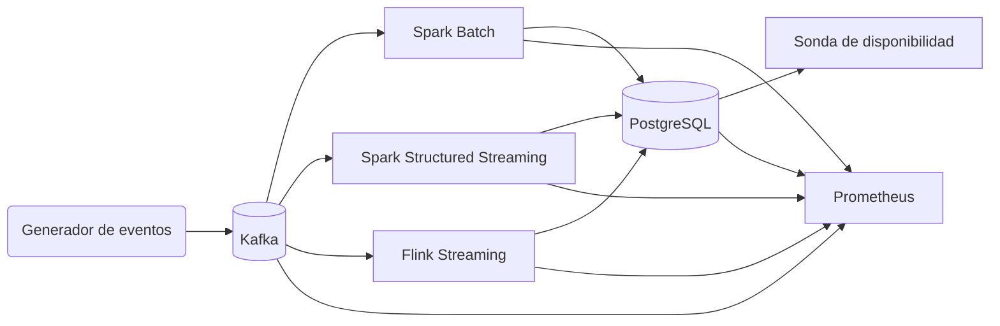
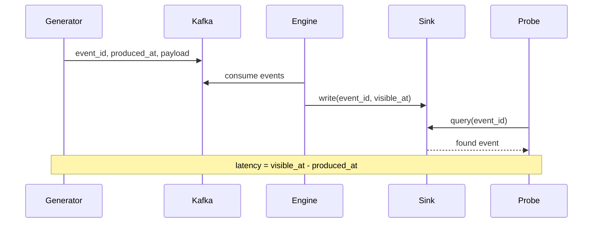

# Arquitectura del Banco de Pruebas

## Objetivo

Medir la latencia de disponibilidad y throughput de tres estrategias de ingestión:

1. Spark Batch (ventanas de 60 s)
2. Spark Structured Streaming (micro-batch de 1/5/10 s)
3. Flink Streaming (flujo continuo exactly-once)

Métrica principal: `visible_at - produced_at` registrada en PostgreSQL.

## Componentes

Todos los servicios corren en Docker Compose para garantizar reproducibilidad en Ubuntu, Windows/WSL2 y MacOS.

## Flujo experimental

## Escenarios soportados

| Escenario   | Tasa base | Payload | Duración |
|-------------|-----------|---------|----------|
| low-load    | 2.000/s   | 512 B   | 20 min   |
| medium-load | 10.000/s  | 512 B   | 20 min   |
| high-load   | 30.000/s  | 512 B   | 20 min   |
| burst       | 10.000/s (base) / 50.000/s (pico) | 512 B | pico de 60s cada 5 min |

Cada escenario admite 5 repeticiones siguiendo el protocolo: `reset -> warmup -> run -> cooldown -> export`.

## Métricas

- Latencia p50/p95/p99 desde la sonda (`probe_latency`).
- Throughput de eventos visibles (`probe_visible_events_total`).
- Eventos emitidos (`generator_events_total`) y tasa de error.
- Recursos de infraestructura vía Prometheus (Kafka/DB/exporters).

Los resultados consolidados se almacenan en `results/` y Grafana incluye un dashboard `Latency Overview` precargado.
