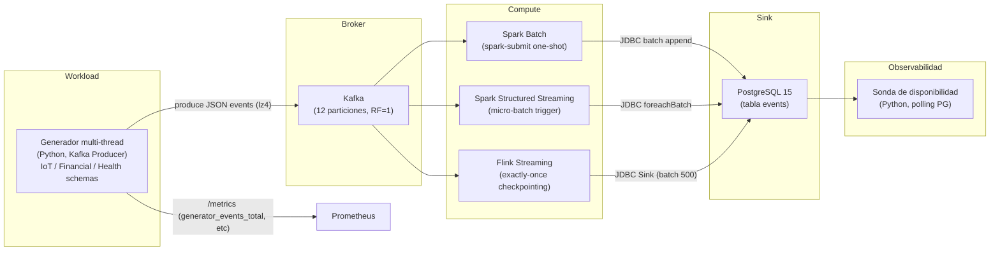
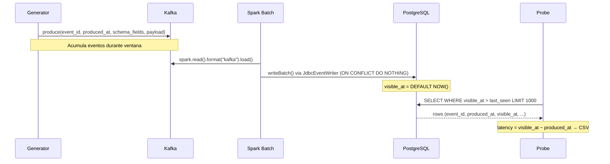
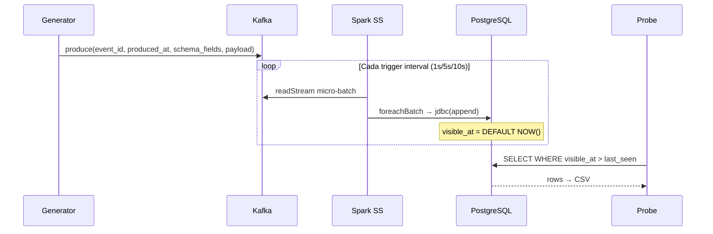
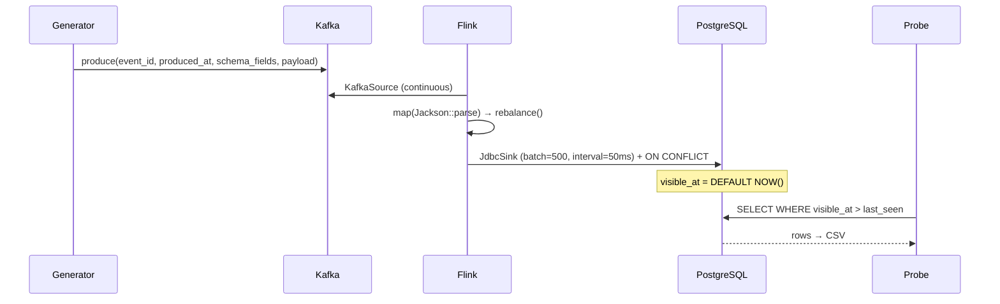
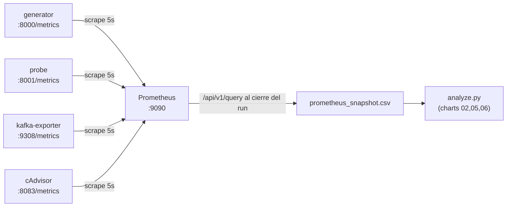
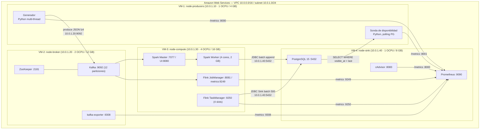

# Arquitectura del Banco de Pruebas

## 1. Objetivo

Medir la **latencia de disponibilidad** y el **throughput de ingesta** de tres estrategias bajo condiciones de alta demanda operativa, comparando estadísticamente sus resultados con tests de significancia.

| # | Estrategia | Motor | Modo de ingesta |
|---|-----------|-------|--------------------|
| 1 | Batch      | Spark 3.5        | Lectura completa de Kafka → escritura Append a PostgreSQL |
| 2 | Micro-batch| Spark Structured Streaming + Kafka | Trigger periódico (1/5/10 s) con `foreachBatch` |
| 3 | Streaming  | Flink 1.18 + Kafka | Flujo continuo exactly-once con JDBC Sink |

**Métrica principal:** `visible_at − produced_at`
- `produced_at` = `System.currentTimeMillis()` en el generador al crear el evento.
- `visible_at` = `DEFAULT (EXTRACT(EPOCH FROM NOW()) * 1000)::BIGINT` en PostgreSQL al hacer INSERT.
- Esta definición garantiza que la medición es **uniforme** para las 3 estrategias.

---

## 2. Diagrama de componentes



---

## 3. Flujo experimental por estrategia

### 3.1 Spark Batch



*Nota: Para garantizar una comparación justa, el script `run.sh` (estrategia batch) incluye una fase de **acumulación** previa de `RUN_DURATION_SECONDS` antes de lanzar el job de Spark, asegurando que el lote procese el mismo volumen de datos que las estrategias de streaming.*

### 3.2 Spark Structured Streaming (Micro-batch)



### 3.3 Flink Streaming



---

## 4. Robustez y Consistencia

El benchmark implementa varias mejoras críticas para asegurar la validez de los datos:

- **Parseo Robusto (Jackson)**: Se eliminó el parseo basado en expresiones regulares en favor de `Jackson Databind` para manejar correctamente el esquema JSON y evitar corrupciones en payloads complejos.
- **Escritura Idempotente**: Tanto Spark Batch como Flink utilizan estrategias `ON CONFLICT (event_id) DO NOTHING` para permitir re-intentos de jobs sin duplicar datos ni fallar por llaves duplicadas.
- **Cierre Elegante y Drain Time**: Los jobs de *Spark Structured Streaming* y *Flink* reciben administrativamente un margen (+20 segundos) adicional de tiempo de vida tras detenerse la generación de eventos, logrando drenar todos los mensajes de Kafka retenidos por backpressure. Sumado a terminaciones por `CompletableFuture`, esto minimiza drásticamente la pérdida experimental de los últimos micro-lotes.

---

## 4. Modelo de datos

```sql
CREATE TABLE events (
    event_id    UUID        PRIMARY KEY,
    produced_at BIGINT      NOT NULL,               -- ms epoch (generador)
    visible_at  BIGINT      NOT NULL DEFAULT (...)   -- ms epoch (PostgreSQL)
    payload     TEXT        NOT NULL,
    strategy    VARCHAR(32) NOT NULL DEFAULT 'unknown',
    scenario    VARCHAR(32) NOT NULL DEFAULT 'unknown',
    run_id      VARCHAR(64) NOT NULL DEFAULT 'unset'
);

CREATE INDEX idx_events_visible_at ON events (visible_at);
CREATE INDEX idx_events_run        ON events (strategy, scenario, run_id);
```

**Fórmula de latencia:**
```
latencia_disponibilidad (ms) = visible_at − produced_at
```

---

## 5. Escenarios de carga

| Escenario | Tasa base | Payload | Pico | Schema default | Duración |
|-----------|-----------|---------|------|----------------|----------|
| `low-load` | 2.000/s | 512 B | — | iot_sensor | 20 min |
| `medium-load` | 10.000/s | 512 B | — | financial_tick | 20 min |
| `high-load` | 30.000/s | 512 B | — | health_monitor | 20 min |
| `burst` | 10.000/s | 512 B | 50.000/s por 60s cada 5 min | financial_tick | 20 min |
| `extreme-load` | 100.000/s | 512 B | — | iot_sensor | 30 min |
| `mixed-payload` | 10.000/s | 512/4096/65536 B (rotativo) | — | iot_sensor | 20 min |

Cada escenario se repite **5 veces** siguiendo el protocolo:
`clean → warmup (30s) → run (duración) → cooldown (10s) → export`.

---

## 6. Schemas de eventos

### iot_sensor
```json
{
  "event_id": "uuid-v4",
  "produced_at": 1709500000000,
  "schema": "iot_sensor",
  "device_id": "sensor-0042",
  "temperature_c": 22.4,
  "humidity_pct": 58.1,
  "pressure_hpa": 1013.5,
  "battery_v": 3.72,
  "status": "ok",
  "payload": "<random alphanumeric>"
}
```

### financial_tick
```json
{
  "event_id": "uuid-v4",
  "produced_at": 1709500000000,
  "schema": "financial_tick",
  "symbol": "BTC-USD",
  "exchange": "binance",
  "price": 61234.50,
  "bid": 61230.12,
  "ask": 61238.90,
  "volume": 0.42,
  "trade_id": "uuid-v4",
  "payload": "<random alphanumeric>"
}
```

### health_monitor
```json
{
  "event_id": "uuid-v4",
  "produced_at": 1709500000000,
  "schema": "health_monitor",
  "patient_id": "P-8821",
  "device_model": "AppleWatch9",
  "heart_rate_bpm": 78,
  "spo2_pct": 98.2,
  "steps_delta": 5,
  "alert": false,
  "location": "home",
  "payload": "<random alphanumeric>"
}
```

---

## 7. Métricas recolectadas — 6 KPIs esenciales

| # | KPI | Definición formal | Fuente | Unidad |
|---|-----|-------------------|--------|--------|
| 1 | **Latencia E2E** | `visible_at − produced_at` (percentiles p50/p95/p99 + IQR + CV%) | `latency_samples.csv` | ms |
| 2 | **Throughput E2E vs Sink** | `N_eventos / (visible_at_max − produced_at_min)` vs `tput_sink_eps` | `latency_samples.csv` + `prometheus_snapshot.csv` | eventos/s |
| 3 | **Fault Recovery Time** | Tiempo desde kill del contenedor hasta recuperar 85% del throughput base | `fault_recovery.csv` | s |
| 4 | **Scaling Efficiency** | `(tput_N / tput_1) / N × 100%` medido en 1→2→3 Spark workers | `results/*/scaling_*w/` | % |
| 5 | **Resource Utilization** | CPU total (cores) + memoria RSS por evento (MB/evento) | `prometheus_snapshot.csv` → cAdvisor | cores / MB/ev |
| 6 | **Kafka Consumer Lag** | `sum(kafka_consumergroup_lag{topic="events"})` al final de cada run | `prometheus_snapshot.csv` → kafka-exporter | mensajes |

Los datos fuente son:
- `results/<strategy>/<scenario>/<run>/latency_samples.csv` — muestra por evento
- `results/<strategy>/<scenario>/<run>/prometheus_snapshot.csv` — snapshot Prometheus al cierre del run
- `results/fault_recovery.csv` — tiempos de recuperación ante fallos inyectados

---

## 8. Análisis estadístico

Por cada escenario se ejecutan:
- **Kruskal-Wallis H test** (no paramétrico): ¿son las distribuciones de latencia de las 3 estrategias estadísticamente diferentes?
- **Mann-Whitney U pairwise** con **corrección Bonferroni**: comparaciones por pares con p-valores ajustados.

### Gráficas generadas (9 total)

| # | Archivo | Descripción | Datos fuente |
|---|---------|-------------|--------------|
| 01 | `01_boxplot_latencia_e2e.png` | Boxplot anotado de latencia E2E con p50/p95/p99/IQR/CV% por estrategia × escenario | `latency_samples.csv` |
| 02 | `02_throughput_dual.png` | Barras duales: Throughput E2E vs escritura al Sink (eventos/s) | `latency_samples.csv` + `prometheus_snapshot.csv` |
| 03 | `03_fault_recovery.png` | Barras horizontales de tiempo de recuperación ante fallos (media ± std) | `fault_recovery.csv` |
| 04 | `04_scaling_efficiency.png` | Eficiencia de escalado horizontal 1→2→3 workers (% de ideal) | `results/*/scaling_*w/` |
| 05 | `05_resource_utilization.png` | Scatter CPU cores vs MB/evento por run y estrategia | `prometheus_snapshot.csv` |
| 06 | `06_kafka_lag.png` | Consumer Lag promedio con umbral crítico de 10.000 mensajes | `prometheus_snapshot.csv` |
| 07 | `07_tabla_resumen.csv/.png` | Tabla completa: p50/p95/p99/IQR/CV%/Min/Max por estrategia × escenario | `latency_samples.csv` |
| 08 | `08_heatmap_escalabilidad.png` | Heatmap de latencia p95 por estrategia × escenario | `latency_samples.csv` |
| 09 | `09_ranking_table.csv/.png` | Ranking objetivo multi-criterio normalizado (pesos: p95=35%, tput=30%, recovery=20%, CV=15%) | todos |

---

## 9. Servicios Docker Compose

| Servicio | Imagen | Puerto | Rol |
|----------|--------|--------|-----|
| `zookeeper` | confluentinc/cp-zookeeper:7.5.3 | 2181 | Coordinación Kafka |
| `kafka` | confluentinc/cp-kafka:7.5.3 | 9092 | Broker de eventos (12 particiones) |
| `kafka-exporter` | danielqsj/kafka-exporter:v1.7.0 | 9308 | Métricas Kafka para Prometheus |
| `spark-master` | apache/spark:3.5.8-java17 | 7077, 8080 | Coordinador Spark |
| `spark-worker-1` | apache/spark:3.5.8-java17 | — | Ejecutor (4 cores, 2 GB) |
| `spark-worker-2` | apache/spark:3.5.8-java17 | — | Ejecutor adicional (profile: scaling) |
| `spark-worker-3` | apache/spark:3.5.8-java17 | — | Ejecutor adicional (profile: scaling) |
| `flink-jobmanager` | flink:1.18.1-scala_2.12-java17 | 8081, 9249 | Coordinador Flink (2 GB) |
| `flink-taskmanager` | flink:1.18.1-scala_2.12-java17 | 9250 | Ejecutor (4 slots, 2 GB) |
| `postgres` | postgres:15 | 5432 | Sink (tabla events) |
| `generator` | python:3.11-slim (custom) | 8000 | Generador multi-thread |
| `probe` | python:3.11-slim (custom) | 8001 | Sonda de disponibilidad |
| `prometheus` | prom/prometheus:v2.51.0 | 9090 | Almacenamiento de métricas de series temporales |
| `cadvisor` | gcr.io/cadvisor/cadvisor:v0.49.1 | 8083 | Métricas de recursos de contenedores |

### Flujo de observabilidad



### Flujo de inyección de fallos

```
fault_inject.sh <strategy> <scenario>
  1. Registra throughput base durante 30 s
  2. Mata el contenedor target (docker stop)
  3. Espera recuperación espontánea (Docker restart policy: unless-stopped)
  4. Mide tiempo hasta que throughput >= 85% del base
  5. Guarda recovery_time_s en results/fault_recovery.csv
```

---

## 10. Estructura de resultados

```
results/
├── latency_samples.csv             # CSV acumulado del probe (todos los runs)
├── fault_recovery.csv              # Tiempos de recuperación ante fallos
├── figures/                        # 9 gráficas generadas por analyze.py
│   ├── 01_boxplot_latencia_e2e.png
│   ├── 02_throughput_dual.png
│   ├── 03_fault_recovery.png
│   ├── 04_scaling_efficiency.png
│   ├── 05_resource_utilization.png
│   ├── 06_kafka_lag.png
│   ├── 07_tabla_resumen.csv
│   ├── 07_tabla_resumen.png
│   ├── 08_heatmap_escalabilidad.png
│   ├── 09_ranking_table.csv
│   ├── 09_ranking_table.png
│   └── statistical_tests.csv
├── batch/
│   ├── low-load/
│   │   ├── run_1/
│   │   │   ├── latency_samples.csv
│   │   │   └── prometheus_snapshot.csv
│   │   ├── run_2/ ... run_5/
│   │   └── scaling_1w/ scaling_2w/ scaling_3w/  # solo con --scaling-test
│   ├── medium-load/ ...
│   ├── high-load/ ...
│   └── burst/ ...
├── microbatch/ ...
└── streaming/ ...
```

---

## 11. Topología distribuida (modo AWS)

El benchmark soporta un modo distribuido donde las 4 capas funcionales se despliegan
en instancias EC2 x86_64 dedicadas en AWS, replicando condiciones de
producción reales. Este modo permite validar la arquitectura bajo condiciones de
red físicamente separada, donde `produced_at` y `visible_at` provienen de relojes
de hardware distintos sincronizados via Amazon Time Sync Service.

### 11.1 Diagrama de componentes distribuidos



### 11.2 Asignación de servicios por VM

| VM | Nombre | IP Privada | OCPU | RAM | Compose file | Servicios |
|---|---|---|---|---|---|---|
| VM-1 | node-producers | 10.0.1.10 | 1 | 4 GB | `docker/producer.yml` | generator, probe |
| VM-2 | node-broker | 10.0.1.20 | 2 | 12 GB | `docker/broker.yml` | zookeeper, kafka, kafka-exporter |
| VM-3 | node-compute | 10.0.1.30 | 4 | 16 GB | `docker/compute.yml` | spark-master, spark-worker, flink-jobmanager, flink-taskmanager |
| VM-4 | node-sink | 10.0.1.40 | 1 | 8 GB | `docker/sink.yml` | postgres, prometheus, cadvisor |

### 11.3 Variables críticas del modo distribuido

| Variable | Valor en modo distribuido | Impacto si es incorrecto |
|---|---|---|
| `KAFKA_ADVERTISED_LISTENERS` | `PLAINTEXT://10.0.1.20:9092` | **Crítica:** Spark y generator no pueden conectar al broker |
| `KAFKA_BOOTSTRAP_SERVERS` | `10.0.1.20:9092` | Generator y probe no producen/leen eventos |
| `POSTGRES_HOST` | `10.0.1.40` | Jobs Spark/Flink y probe no pueden escribir/leer resultados |
| `SPARK_MASTER_URL` | `spark://10.0.1.30:7077` | spark-submit falla |
| `FLINK_REST_URL` | `http://10.0.1.30:8081` | Submit de jobs Flink falla |

### 11.4 Consideración de clock skew (validez experimental)

La métrica `latencia = visible_at − produced_at` involucra dos relojes físicos
distintos (VM-1 y VM-4). El offset NTP se controla así:

- **Mecanismo:** chrony apunta al NTP interno de AWS `169.254.169.123` (latencia ~0.1 ms)
- **Offset residual típico:** < 1 ms → despreciable frente a p50 de batch (segundos)
  y p50 de streaming (20–60 ms)
- **Umbral de seguridad experimentalmente definido:** 5 ms
- **Verificación automática:** `check-clock-sync.sh` bloquea el experimento si cualquier
  nodo supera el umbral y registra el log en `results/clock_offsets_YYYYMMDD_HHmmSS.csv`
