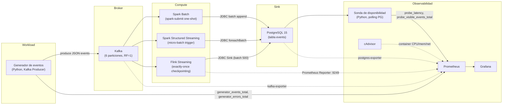
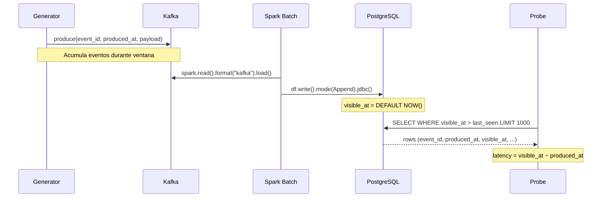
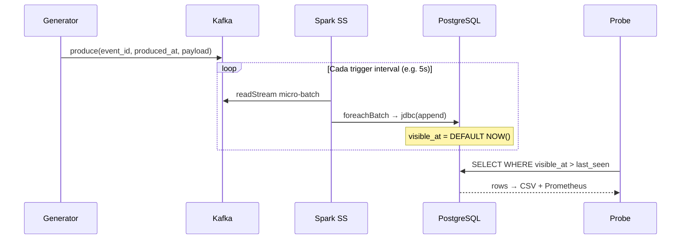
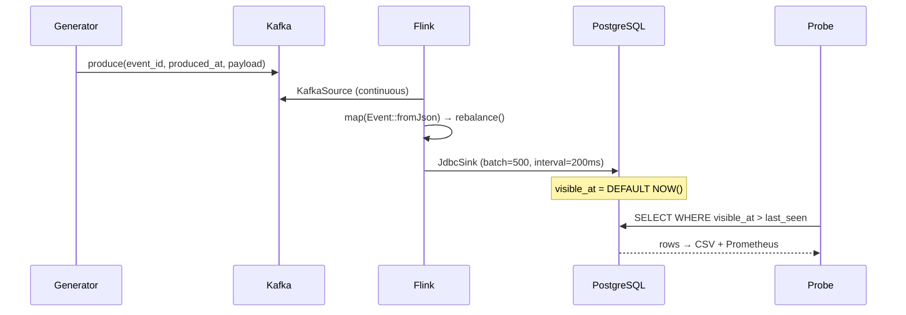

# Arquitectura del Banco de Pruebas

## 1. Objetivo

Medir la **latencia de disponibilidad** y el **throughput de ingesta** de tres estrategias:

| # | Estrategia | Motor | Modo de ingesta |
|---|-----------|-------|-----------------|
| 1 | Batch | Spark 3.5 | Lectura completa de Kafka → escritura Append a PostgreSQL |
| 2 | Micro-batch | Spark Structured Streaming + Kafka | Trigger periódico (1/5/10 s) con `foreachBatch` |
| 3 | Streaming | Flink 1.18 + Kafka | Flujo continuo exactly-once con JDBC Sink |

**Métrica principal:** `visible_at − produced_at`  
- `produced_at` = `System.currentTimeMillis()` en el generador al crear el evento.  
- `visible_at` = `DEFAULT (EXTRACT(EPOCH FROM NOW()) * 1000)::BIGINT` en PostgreSQL al hacer INSERT.  
- Esta definición garantiza que la medición es **uniforme** para las 3 estrategias: el momento exacto en que PostgreSQL persiste el registro.

---

## 2. Diagrama de componentes



---

## 3. Flujo experimental por estrategia

### 3.1 Spark Batch



### 3.2 Spark Structured Streaming (Micro-batch)



### 3.3 Flink Streaming



---

## 4. Modelo de datos

```sql
CREATE TABLE events (
    event_id    UUID        PRIMARY KEY,
    produced_at BIGINT      NOT NULL,               -- ms epoch (generador)
    visible_at  BIGINT      NOT NULL DEFAULT (...)   -- ms epoch (PostgreSQL)
    payload     TEXT        NOT NULL,
    strategy    VARCHAR(32) NOT NULL DEFAULT 'unknown',
    scenario    VARCHAR(32) NOT NULL DEFAULT 'unknown',
    run_id      VARCHAR(64) NOT NULL DEFAULT 'unset'
);

-- Índices para consultas del probe y análisis
CREATE INDEX idx_events_visible_at ON events (visible_at);
CREATE INDEX idx_events_run        ON events (strategy, scenario, run_id);
```

**Fórmula de latencia:**
```
latencia_disponibilidad (ms) = visible_at − produced_at
```

---

## 5. Escenarios de carga

| Escenario | Tasa base | Payload | Pico | Duración |
|-----------|-----------|---------|------|----------|
| `low-load` | 2.000/s | 512 B | — | 20 min |
| `medium-load` | 10.000/s | 512 B | — | 20 min |
| `high-load` | 30.000/s | 512 B | — | 20 min |
| `burst` | 10.000/s | 512 B | 50.000/s por 60s cada 5 min | 20 min |

Cada escenario se repite **5 veces** siguiendo el protocolo:
`clean → warmup (30s) → run (duración) → cooldown (10s) → export`.

---

## 6. Métricas recolectadas

| Categoría | Métrica | Fuente |
|-----------|---------|--------|
| **Latencia** | `probe_latency` (histograma p50/p95/p99) | Probe → Prometheus |
| **Throughput** | `probe_visible_events_total`, `probe_throughput_events_per_sec` | Probe → Prometheus |
| **Generación** | `generator_events_total`, `generator_errors_total`, `generator_bytes_total` | Generator → Prometheus |
| **Producción** | `generator_produce_latency_ms` | Generator → Prometheus |
| **Recursos** | CPU, memoria, red por contenedor | cAdvisor → Prometheus |
| **Kafka** | Consumer lag, offsets, particiones | kafka-exporter → Prometheus |
| **PostgreSQL** | Conexiones, transacciones, tamaño | postgres-exporter → Prometheus |
| **Flink** | Records in/out, checkpoints, backpressure | Flink Prometheus Reporter |
| **CSV** | `latency_samples.csv` con `event_id, produced_at, visible_at, latency_ms, strategy, scenario, run_id` | Probe → disco |

---

## 7. Servicios Docker Compose

| Servicio | Imagen | Puerto | Rol |
|----------|--------|--------|-----|
| `zookeeper` | confluentinc/cp-zookeeper:7.5.3 | 2181 | Coordinación Kafka |
| `kafka` | confluentinc/cp-kafka:7.5.3 | 9092 | Broker de eventos |
| `kafka-exporter` | danielqsj/kafka-exporter:v1.7.0 | 9308 | Métricas Kafka |
| `spark-master` | apache/spark:3.5.8-java17 | 7077, 8080 | Coordinador Spark |
| `spark-worker` | apache/spark:3.5.8-java17 | — | Ejecutor Spark |
| `flink-jobmanager` | flink:1.18.1-scala_2.12-java17 | 8081, 9249 | Coordinador Flink |
| `flink-taskmanager` | flink:1.18.1-scala_2.12-java17 | 9250 | Ejecutor Flink |
| `postgres` | postgres:15 | 5432 | Sink (tabla events) |
| `postgres-exporter` | postgres-exporter:v0.15.0 | 9187 | Métricas PostgreSQL |
| `cadvisor` | cadvisor:v0.49.1 | 8888 | Métricas de contenedores |
| `prometheus` | prometheus:v2.49.1 | 9090 | Almacén de métricas |
| `grafana` | grafana:10.3.1 | 3000 | Visualización |
| `generator` | python:3.11-slim (custom) | 8000 | Generador de carga |
| `probe` | python:3.11-slim (custom) | 8001 | Sonda de disponibilidad |

---

## 8. Estructura de resultados

```
results/
├── latency_samples.csv           # CSV acumulado del probe (todos los runs)
├── batch/
│   ├── low-load/
│   │   ├── run_1/
│   │   │   ├── latency_samples.csv
│   │   │   └── prometheus_snapshot.csv
│   │   ├── run_2/ ...
│   │   └── run_5/ ...
│   ├── medium-load/ ...
│   ├── high-load/ ...
│   └── burst/ ...
├── microbatch/ ...
└── streaming/ ...
```
