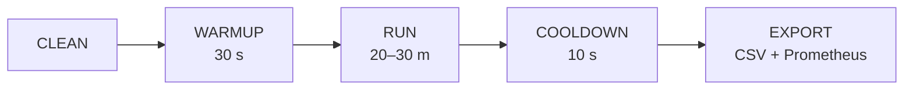

# Protocolo Experimental

Este documento describe el procedimiento paso a paso para ejecutar el banco de
pruebas de la tesis. Cada corrida sigue un protocolo riguroso para garantizar
**reproducibilidad** y **validez estadística**.

---

## 1. Prerrequisitos

- [ ] Docker Desktop con ≥ 8 GB de RAM asignados (recomendado: 12 GB para `extreme-load`).
- [ ] Docker Compose v2 instalado.
- [ ] Java 17+ (Gradle wrapper incluido).
- [ ] Python 3.10+ con pip (para `export_metrics.py` y `analyze.py`).
- [ ] WSL2 habilitado en Windows (para los scripts Bash).
- [ ] Clonar el repositorio y copiar `.env.example` a `.env`.

## 2. Preparación (una sola vez)

```bash
# 1. Compilar los JARs de los tres jobs
./gradlew buildJobs          # Linux / macOS / WSL2
.\\gradlew.bat buildJobs     # Windows PowerShell

# 2. Construir las imágenes Docker del generador y la sonda
docker compose build generator probe

# 3. Levantar la infraestructura completa
docker compose up -d --no-build

# 4. Verificar que todos los servicios estén saludables
docker compose ps

# 5. Instalar dependencias de análisis
python -m venv analysis/.venv
analysis/.venv/Scripts/pip install -r analysis/requirements.txt  # Windows
# analysis/.venv/bin/pip install -r analysis/requirements.txt    # Linux/macOS
```

## 3. Protocolo por corrida

Cada corrida experimental consta de 5 fases:



### 3.1 CLEAN
- Borrar el tópico `events` de Kafka y recrearlo (12 particiones).
- Truncar la tabla `events` en PostgreSQL.
- Limpiar checkpoints de Spark.
- **Opcional:** Borrar carpeta `results/` para empezar de cero.
- **Script:** `scripts/clean.sh <scenario>` (u usar `--all` para limpieza total).

### 3.2 WARMUP (30 segundos)
- El generador comienza a producir eventos, pero los primeros 30 s
  se marcan como "warmup" (`generator_warmup_active = 1`).
- Esto permite estabilizar JVMs (JIT), llenar caches, inicializar
  conexiones JDBC y asentarse el consumer lag antes de medir.
- **Configuración:** `WARMUP_SECONDS=30` en `.env`.

### 3.3 RUN (duración del escenario)
- Producción sostenida a la tasa definida por el escenario.
- El generador usa múltiples threads (1 por cada 20k ev/s) para
  mantener tasas altas de forma sostenida.
- El probe registra latencias en `results/latency_samples.csv`.
- Duración: **20 min** (low/medium/high/burst/mixed-payload), **30 min** (extreme-load).
- **Configuración:** `RUN_DURATION_SECONDS` en `.env`.

### 3.4 COOLDOWN (10 segundos)
- Esperar a que los buffers se drenen (Flink JDBC Sink, Kafka producer queue).
- No se producen nuevos eventos.

### 3.5 EXPORT
- Copiar `latency_samples.csv` al directorio de la corrida.
- Exportar snapshot de métricas Prometheus (≥36 métricas) con `scripts/export_metrics.py`.

## 4. Ejecución manual (corrida individual)

```bash
# Batch
./scripts/run_batch.sh low-load run_1

# Micro-batch (trigger 5 segundos)
./scripts/run_microbatch.sh medium-load run_1 "5 seconds"

# Streaming
./scripts/run_streaming.sh high-load run_1
```

## 5. Ejecución automatizada (experimento completo)

```bash
# Todas las estrategias, todos los escenarios estándar, 5 repeticiones
./scripts/run_experiment.sh

# Experimento rápido (1 repetición, 4 min por corrida):
./scripts/run_experiment.sh --reps 1 --duration 240

# Solo streaming, high-load y extreme-load, 3 repeticiones
./scripts/run_experiment.sh --strategies streaming --scenarios "high-load extreme-load" --reps 3

# Todas las estrategias, trigger de 10s para micro-batch, ventana de export 10m
./scripts/run_experiment.sh --trigger "10 seconds" --window 10m

# Override de schema para todos los runs
./scripts/run_experiment.sh --schema financial_tick
```

## 6. Matriz experimental estándar (tesis)

| Estrategia | Escenarios | Repeticiones | Total corridas |
|-----------|-----------|-------------|----------------|
| Batch | low, medium, high, burst | 5 | 20 |
| Micro-batch | low, medium, high, burst | 5 | 20 |
| Streaming | low, medium, high, burst | 5 | 20 |
| **Subtotal** | | | **60** |
| Batch | extreme-load, mixed-payload | 3 | 6 |
| Micro-batch | extreme-load, mixed-payload | 3 | 6 |
| Streaming | extreme-load, mixed-payload | 3 | 6 |
| **Total completo** | | | **78** |

### Estimación de volumen de datos (60 corridas estándar)

| Escenario | Tasa | Duración | Eventos/corrida | × 15 runs (3 strat × 5) |
|-----------|------|----------|-----------------|------------------------|
| low-load | 2k/s | 20 min | ~2.4M | ~36M |
| medium-load | 10k/s | 20 min | ~12M | ~180M |
| high-load | 30k/s | 20 min | ~36M | ~540M |
| burst | ~15k/s avg | 20 min | ~18M | ~270M |
| **Total** | | | | **~1,026 M eventos** |

## 7. Variables controladas

| Variable | Valor fijo | Justificación |
|----------|-----------|---------------|
| Particiones Kafka | 12 | Soporte de paralelismo hasta extreme-load |
| Factor de replicación | 1 | Entorno single-node; elimina overhead de réplica |
| Payload base | 512 B | Representativo de eventos IoT/telemetría |
| Payload en mixed-payload | 512 B / 4 KB / 64 KB | Variación de tamaño para análisis de sensibilidad |
| Sink | PostgreSQL 15 | Único sink para las 3 estrategias |
| Workers Spark | 1 (4 cores, 2 GB) | Control de recursos; consistente con Flink |
| TaskSlots Flink | 4 | Equivalente en paralelismo a Spark |
| Checkpointing Flink | 10 s, exactly-once | Producción realista |
| Trigger micro-batch | 5 s (default) | Balance latencia/eficiencia documentado |

## 8. Fase de Análisis y Reportaje

Una vez completadas las corridas, se consolidan y generan las gráficas estadísticas.

### 8.1 Generación de gráficas y estadísticas

```powershell
# Windows
analysis\.venv\Scripts\python.exe analysis\analyze.py

# Linux / macOS
analysis/.venv/bin/python analysis/analyze.py
```

### 8.2 Resultados generados (`results/figures/`)

| # | Archivo | Tipo de análisis |
|---|---------|-----------------|
| 01 | `01_boxplot_latencia.png` | Distribución de latencia por estrategia y escenario |
| 02 | `02_cdf_latencia.png` | Función de distribución acumulada |
| 03 | `03_percentiles_barras.png` | Comparación p50/p95/p99 |
| 04 | `04_throughput.png` | Throughput promedio ± SD |
| 05 | `05_estabilidad_runs.png` | Variabilidad entre repeticiones |
| 06 | `06_tabla_resumen.csv/.png` | Tabla completa de resultados |
| 07 | `07_latencia_temporal.png` | Evolución temporal de latencia (p50 + banda p95) |
| 08 | `08_eficiencia_recursos.png` | Scatter latencia p95 vs. CPU promedio |
| 09 | `09_kafka_lag.png` | Consumer lag por estrategia y escenario |
| 10 | `10_tasa_errores.png` | Tasa de errores del generador y probe |
| 11 | `11_significancia.csv/.png` | Kruskal-Wallis H + Mann-Whitney U Bonferroni |
| 12 | `12_radar_multikpi.png` | Radar multi-KPI normalizado holístico |

### 8.3 Interpretación de la tabla de significancia

- **H (KW)**: estadístico de Kruskal-Wallis. Valores altos indican diferencias mayores.
- **p-valor**: < 0.05 indica diferencias estadísticamente significativas entre las 3 estrategias.
- **p-valor (Bonf.)**: p-valor ajustado por corrección Bonferroni para comparaciones pairwise.
- **✓**: diferencia significativa al 5%. **✗**: diferencia no significativa.
