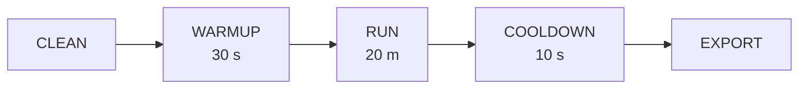

# Protocolo Experimental

Este documento describe el procedimiento paso a paso para ejecutar el banco de
pruebas de la tesis. Cada corrida sigue un protocolo riguroso para garantizar
**reproducibilidad** y **validez estadística**.

---

## 1. Prerrequisitos

- [ ] Docker Desktop con ≥ 6 GB de RAM asignados (recomendado 8 GB para `high-load`).
- [ ] Docker Compose v2 instalado.
- [ ] Java 21 (Gradle wrapper incluido).
- [ ] WSL2 habilitado en Windows (para los scripts Bash).
- [ ] Clonar el repositorio y copiar `.env.example` a `.env`.

## 2. Preparación (una sola vez)

```bash
# 1. Compilar los JARs de los tres jobs

# Linux / macOS / WSL2:
./gradlew buildJobs

# Windows (PowerShell):
.\gradlew.bat buildJobs

# 2. Construir las imágenes Docker del generador y la sonda
docker compose build generator probe

# 3. Levantar la infraestructura completa
docker compose up -d --no-build

# 4. Verificar que todos los servicios estén saludables
docker compose ps
```

## 3. Protocolo por corrida

Cada corrida experimental consta de 5 fases:



### 3.1 CLEAN
- Borrar el tópico `events` de Kafka y recrearlo.
- Truncar la tabla `events` en PostgreSQL.
- Limpiar checkpoints de Spark.
- **Script:** `scripts/clean.sh <scenario>`

### 3.2 WARMUP (30 segundos)
- El generador comienza a producir eventos, pero los primeros 30 s
  se marcan como "warmup" (`generator_warmup_active = 1`).
- Esto permite estabilizar JVMs (JIT), llenar caches y establecer
  conexiones antes de medir.
- **Configuración:** `WARMUP_SECONDS=30` en `.env`.

### 3.3 RUN (duración del escenario)
- Producción sostenida a la tasa definida por el escenario.
- El probe registra latencias en `results/latency_samples.csv`.
- Duración recomendada: **20 minutos** (1200 s).
- **Configuración:** `RUN_DURATION_SECONDS=1200` en `.env`.

### 3.4 COOLDOWN (10 segundos)
- Esperar a que los buffers se drenen (especialmente Flink JDBC Sink y
  Kafka producer).
- No se producen nuevos eventos.

### 3.5 EXPORT
- Copiar `latency_samples.csv` al directorio de la corrida.
- Exportar snapshot de métricas Prometheus con `scripts/export_metrics.py`.

## 4. Ejecución manual (corrida individual)

```bash
# Batch
./scripts/run_batch.sh low-load run_1

# Micro-batch (trigger 5 segundos)
./scripts/run_microbatch.sh medium-load run_1 "5 seconds"

# Streaming
./scripts/run_streaming.sh high-load run_1
```

## 5. Ejecución automatizada (experimento completo)

```bash
# Todas las estrategias, todos los escenarios, 5 repeticiones
./scripts/run_experiment.sh

# Solo streaming, solo high-load, 3 repeticiones
./scripts/run_experiment.sh --strategies streaming --scenarios high-load --reps 3

# Todas las estrategias, trigger de 10s para micro-batch
./scripts/run_experiment.sh --trigger "10 seconds"
```

## 6. Matriz experimental

| Estrategia | Escenarios | Repeticiones | Total corridas |
|-----------|-----------|-------------|---------------|
| Batch | 4 | 5 | 20 |
| Micro-batch | 4 | 5 | 20 |
| Streaming | 4 | 5 | 20 |
| **Total** | | | **60** |

## 7. Variables controladas

| Variable | Valor fijo | Justificación |
|----------|-----------|---------------|
| Particiones Kafka | 6 | Suficiente paralelismo sin overhead de coordinación |
| Factor de replicación | 1 | Entorno single-node; elimina overhead de réplica |
| Payload | 512 B | Representativo de eventos IoT/telemetría |
| Sink | PostgreSQL 15 | Único sink para las 3 estrategias |
| Workers Spark | 1 (2 cores, 1 GB) | Control de recursos |
| TaskSlots Flink | 1 | Equivalente en paralelismo a Spark |
| Checkpointing Flink | 10 s, exactly-once | Producción realista |

## 8. Análisis posterior

Los resultados se consolidan en:

```
results/<strategy>/<scenario>/run_<n>/
├── latency_samples.csv       # (event_id, produced_at, visible_at, latency_ms, strategy, scenario, run_id)
└── prometheus_snapshot.csv   # (metric, labels, value, timestamp)
```

Para el análisis estadístico, se recomienda:

1. **Calcular percentiles** p50, p95, p99 de latencia por estrategia × escenario.
2. **Calcular throughput** como `COUNT(*) / duración_efectiva`.
3. **Boxplots** de latencia agrupados por estrategia.
4. **Pruebas de hipótesis** (Kruskal-Wallis o ANOVA si la distribución lo permite).
5. **Intervalos de confianza** al 95% para cada métrica.
