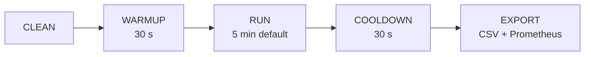

# Protocolo Experimental

Este documento describe el procedimiento paso a paso para ejecutar el banco de
pruebas de la tesis. Cada corrida sigue un protocolo riguroso para garantizar
**reproducibilidad** y **validez estadística**.

---

## 1. Prerrequisitos

- [ ] Docker Desktop con ≥ 8 GB de RAM asignados (recomendado: 12 GB para `extreme-load`).
- [ ] Docker Compose v2 instalado.
- [ ] Java 17+ (Gradle wrapper incluido).
- [ ] Python 3.10+ con pip (para `export_metrics.py` y `analyze.py`).
- [ ] WSL2 habilitado en Windows (para los scripts Bash).
- [ ] Clonar el repositorio y copiar `.env.example` a `.env`.

## 2. Preparación (una sola vez)

```bash
# 1. Compilar los JARs de los tres jobs
./gradlew buildJobs          # Linux / macOS / WSL2
.\gradlew.bat buildJobs      # Windows PowerShell

# 2. Construir imágenes Docker y levantar la infraestructura
./scripts/manage.sh up

# 3. Verificar que todos los servicios estén saludables
./scripts/manage.sh status

# 4. Crear entorno virtual Python e instalar dependencias
python -m venv analysis/.venv
# En Windows:
analysis\.venv\Scripts\pip install -r analysis\requirements.txt
# En Linux/macOS:
analysis/.venv/bin/pip install -r analysis/requirements.txt
```

## 3. Protocolo por corrida

Cada corrida experimental consta de 5 fases:



### 3.1 CLEAN
- Borrar el tópico `events` de Kafka y recrearlo (12 particiones).
- Truncar la tabla `events` en PostgreSQL.
- Limpiar checkpoints de Spark.
- Resetear el CSV del probe a solo la cabecera.
- **Script:** `./scripts/manage.sh clean`

### 3.2 WARMUP (30 segundos)
- El generador comienza a producir eventos; los primeros 30 s
  se marcan como "warmup" (`generator_warmup_active = 1`) en Prometheus.
- Propósito: estabilizar la JVM (JIT compiler), llenar caches L1/L2,
  inicializar conexiones JDBC y dejar que el consumer lag alcance estado estacionario.
- **El script `analyze.py` filtra estos 30 s automáticamente** (parámetro `--warmup-ms 30000`)
  de todos los runs de estrategias no-batch (streaming y microbatch).
- Para Batch, el warmup está estructuralmente incorporado en la fase de acumulación.
- **Configuración:** `WARMUP_SECONDS=30` (por defecto en `experiment.sh`).

### 3.3 RUN (duración configurable, default 5 min)
- Producción sostenida a la tasa definida por el escenario.
- El generador usa múltiples threads (1 por cada 20k ev/s) para
  mantener tasas altas de forma sostenida.
- El probe registra latencias en `results/latency_samples.csv`.
- **Configuración:** `RUN_DURATION_SECONDS=300` (default) o `--duration` en `experiment.sh`.

### 3.4 COOLDOWN (30 segundos)
- Esperar a que los buffers se drenen (Flink JDBC Sink, Kafka producer queue).
- No se producen nuevos eventos.
- **30 s garantiza un checkpoint completo de Flink** (intervalo de checkpoint = 10 s).

### 3.5 EXPORT
- Copiar `latency_samples.csv` al directorio de la corrida (`results/<strategy>/<scenario>/<run_id>/`).
- Exportar snapshot de métricas Prometheus (36+ métricas) con `scripts/export_metrics.py`.
- El snapshot se toma **inmediatamente al terminar el run**, con ventana configurable (default: `5m`).
  > **Nota metodológica:** Para Batch, el snapshot puede no capturar CPU del Spark job si
  > este terminó más de 5 minutos antes. Usar `--window 20m` para corridas batch largas.

## 4. Ejecución manual (corrida individual)

```bash
# Batch
./scripts/run.sh batch low-load run_1

# Micro-batch (trigger 5 segundos)
./scripts/run.sh microbatch medium-load run_1 "5 seconds"

# Streaming
./scripts/run.sh streaming high-load run_1

# Variables de entorno opcionales
RUN_DURATION_SECONDS=600 ./scripts/run.sh batch high-load run_1
FLINK_DETACHED=true ./scripts/run.sh streaming burst run_1
```

## 5. Ejecución automatizada (experimento completo)

```bash
# Todas las estrategias, todos los escenarios estándar, 5 repeticiones
./scripts/experiment.sh

# Experimento rápido (1 rep, 3 min por corrida):
./scripts/experiment.sh --quick

# Solo streaming, escenarios extremos, 3 repeticiones
./scripts/experiment.sh --strategies streaming --scenarios "high-load extreme-load" --reps 3

# Todas las estrategias, trigger de 10s para micro-batch, ventana de export 10m
./scripts/experiment.sh --trigger "10 seconds" --window 10m

# Override de schema para todos los runs
./scripts/experiment.sh --schema financial_tick

# Especificar warmup y cooldown explícitamente
./scripts/experiment.sh --warmup 30 --cooldown 30
```

## 6. Matriz experimental estándar (tesis)

| Estrategia | Escenarios | Repeticiones | Total corridas |
|-----------|-----------|-------------|----------------|
| Batch | low, medium, high, burst | 5 | 20 |
| Micro-batch | low, medium, high, burst | 5 | 20 |
| Streaming | low, medium, high, burst | 5 | 20 |
| **Subtotal** | | | **60** |
| Batch | extreme-load, mixed-payload | 3 | 6 |
| Micro-batch | extreme-load, mixed-payload | 3 | 6 |
| Streaming | extreme-load, mixed-payload | 3 | 6 |
| **Total completo** | | | **78** |

### Variables controladas

| Variable | Valor fijo | Justificación |
|----------|-----------|---------------|
| Particiones Kafka | 12 | Soporte de paralelismo hasta extreme-load |
| Factor de replicación | 1 | Entorno single-node; elimina overhead de réplica |
| Payload base | 512 B | Representativo de eventos IoT/telemetría |
| Sink | PostgreSQL 15 | Único sink para las 3 estrategias (fair comparison) |
| Workers Spark | 1 (4 cores, 2 GB) | Control de recursos; consistente con Flink |
| TaskSlots Flink | 4 | Equivalente en paralelismo a Spark |
| Checkpointing Flink | 10 s, exactly-once | Configuración de producción realista |
| Trigger micro-batch | 5 s (default) | Balance latencia/eficiencia documentado en literatura |
| Warmup excluido | 30 s por run | Filtrado automático en `analyze.py` (post-procesamiento) |
| Cooldown | 30 s | Margen sobre intervalo de checkpoint Flink (10 s) |

## 7. Fase de Análisis

Una vez completadas las corridas, se consolidan y generan las gráficas estadísticas.

### 7.1 Generación de gráficas y estadísticas

```bash
# Windows
analysis\.venv\Scripts\python.exe analysis\analyze.py

# Linux / macOS / WSL2
analysis/.venv/bin/python analysis/analyze.py

# Parámetros opcionales
analysis/.venv/bin/python analysis/analyze.py \
    --results-dir ./results \
    --output ./results/figures \
    --warmup-ms 30000
```

### 7.2 Gráficas generadas (`results/figures/`)

| # | Archivo | Tipo de análisis | Novedad |
|---|---------|-----------------|---------|
| 01 | `01_violin_boxplot_latencia.png` | Distribución real: violín (densidad) + caja (p25/p75) | ✦ Mejorado |
| 02 | `02_cdf_latencia.png` | CDF con eje X en escala logarítmica | ✦ Mejorado |
| 03 | `03_percentiles_barras.png` | Comparación p50/p95/p99 por estrategia | — |
| 04 | `04_throughput.png` | Throughput E2E promedio ± SD | — |
| 04b | `04b_throughput_dual.png` | Throughput E2E vs escritura al sink (dos métricas) | ✦ Nuevo |
| 05 | `05_estabilidad_runs.png` | Variabilidad entre repeticiones por run | — |
| 06 | `06_tabla_resumen.csv/.png` | Tabla completa: p50/p95/p99 + **IQR, CV%, Min, Max** | ✦ Mejorado |
| 07 | `07_latencia_temporal.png` | Serie temporal facetada × todos los escenarios | ✦ Mejorado |
| 08 | `08_eficiencia_recursos.png` | Scatter latencia p95 vs. CPU promedio | — |
| 09 | `09_kafka_lag.png` | Consumer lag por estrategia y escenario | — |
| 10 | `10_tasa_errores.png` | Tasa de errores del generador y probe | — |
| 11 | `11_significancia.csv/.png` | Kruskal-Wallis H + Mann-Whitney U Bonferroni | — |
| 12 | `12_radar_multikpi.png` | Radar multi-KPI normalizado holístico | — |
| 13 | `13_heatmap_escalabilidad.png` | Heatmap latencia p95: degradación con la carga | ✦ Nuevo |
| 14 | `14_ranking_table.csv/.png` | Ranking objetivo por KPI (sin normalización arbitraria) | ✦ Nuevo |

### 7.3 Interpretación de la tabla de significancia

- **H (KW)**: estadístico de Kruskal-Wallis. Valores altos indican diferencias mayores.
- **p-valor**: < 0.05 indica diferencias estadísticamente significativas entre las 3 estrategias.
- **p-valor (Bonf.)**: p-valor ajustado por corrección Bonferroni para comparaciones pairwise.
- Las diferencias encontradas tienen alta significancia (p → 0) dada la magnitud de las muestras.

### 7.4 Filtro de warmup (metodología)

El script excluye automáticamente los primeros **30 segundos** de cada run para estrategias
streaming y microbatch, basado en el timestamp `produced_at` de cada evento:

- **Streaming / Microbatch:** Se filtran eventos con `produced_at < run_start + 30 000 ms`.
  Esto elimina latencias anómalas durante la inicialización JVM (JIT compiler).
- **Batch:** Exento del filtro — su warmup es estructural (toda la fase de acumulación
  ocurre antes de que el job de Spark ejecute, por lo que los datos ya reflejan
  el estado estacionario del sistema cuando ingresan a PostgreSQL).
