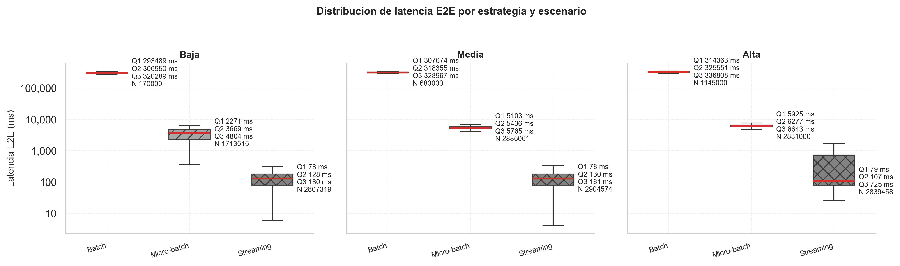
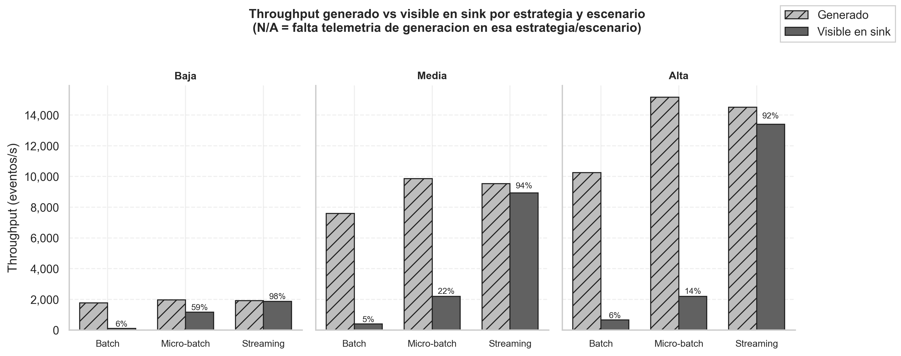
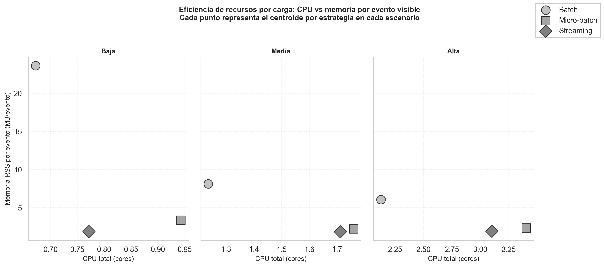
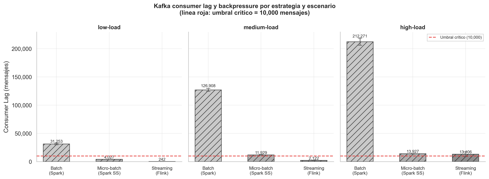
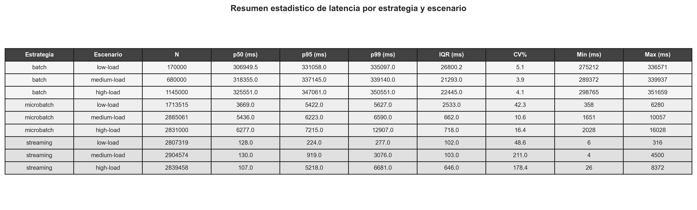

# Experimental Brief: Figure-Based Results Analysis

Date: 2026-04-08

## Figures Analyzed

### 1) End-to-end Latency Distribution

### 2) Generated vs Sink-Visible Throughput

### 3) Resource Efficiency (Centroids by strategy and load)

### 4) Kafka Consumer Lag / Backpressure

### 5) Latency Statistical Summary Table

## Brief Analysis

The latency figures and the statistical table show a stable ranking across all loads: streaming has the lowest central latency (p50 around 107-130 ms), micro-batch stays in the seconds range (p50 around 3.7-6.3 s), and batch remains in the minutes range (p50 around 307-326 s). This confirms that moving from batch to continuous processing materially reduces end-to-end delay, with streaming preserving the strongest median behavior under low, medium, and high load.

Throughput and lag together indicate clear operational differences under pressure. Streaming keeps the highest visible-in-sink retention (about 98%, 94%, and 92% from low to high), while batch and micro-batch lose a larger fraction of generated events as load increases. The lag chart is consistent with this: batch stays far above the 10k critical threshold in all scenarios, micro-batch approaches/exceeds the threshold at medium and high load, and streaming remains low at low/medium load and near threshold at high load.

The centroid-only resource efficiency plot shows batch with significantly higher memory per event in every scenario (especially at low load), while micro-batch and streaming are much lower in MB/event and scale with higher CPU as load rises. Overall, the combined evidence favors streaming as the best trade-off for latency and effective delivery, with micro-batch as an intermediate option and batch mainly suitable when latency is not a primary requirement.
